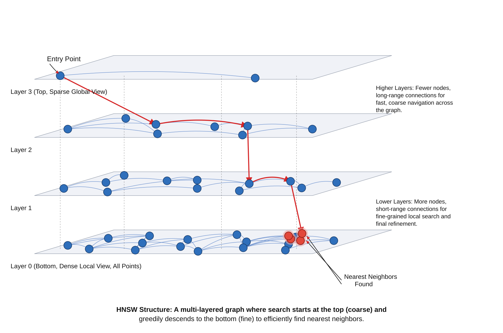
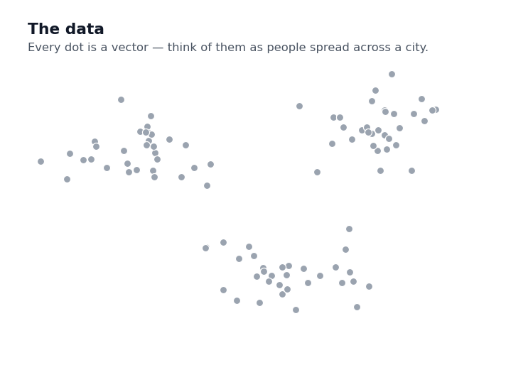
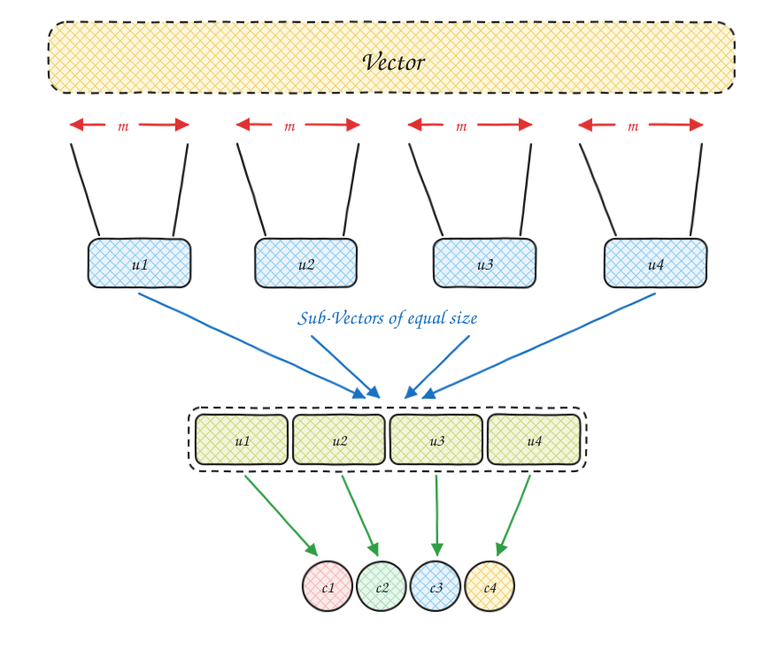
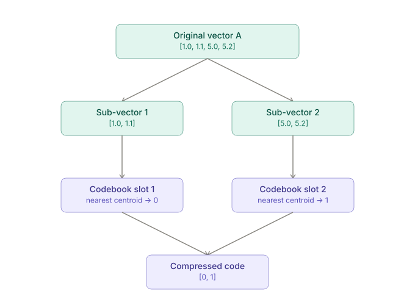
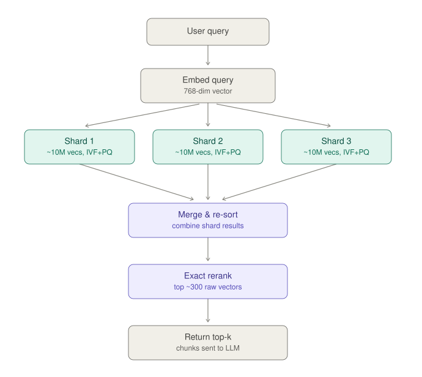

# How to Handle Large Vector DB Search

> A step-by-step guide, built from the ground up. Read top to bottom — each part
> creates the problem that the next part solves.

Every technique in this note exists because of one number: **how many vectors you have.**
At ten thousand vectors, none of this matters — the simple approach works fine. At ten
million, the simple approach is unusable, and every fix you reach for creates a new problem
of its own.

So this note is written as a chain, not a catalogue:

| Part | The problem on the table | The move |
| --- | --- | --- |
| 1 | Comparing the query to every vector is too slow | — |
| 2 | ↳ so: navigate a graph instead of scanning (**HNSW**) | but it eats memory |
| 3 | ↳ so: split the space into buckets instead (**IVF**) | but it can miss neighbours at bucket borders |
| 4 | ↳ and separately: the *vectors themselves* are too big (**PQ**) | but compression loses accuracy |
| 5 | ↳ and none of it explains updates, deletes, or filtering | |
| 6 | ↳ so what does a real system actually run? | all of them, stacked |
| 7 | ↳ and what's better now? | |

Nothing here is a "winner." Each tool trades accuracy or memory or build time for speed,
and the whole game is knowing which trade you're making.

---

# Part 1 — Ground rules

## 01 · What we're actually trying to do

Before any of the algorithms make sense, the job itself has to be clear.

You take your documents — support articles, product descriptions, code files, whatever — and
run each one through an embedding model. Out comes a **vector**: a list of numbers, typically
768, 1536, or 3072 of them, that positions the document in space. Documents about similar
things land near each other.

A user's query goes through the same model and becomes a vector too. So "find relevant
documents" turns into a geometry question:

> **Given one query vector, find the `k` stored vectors closest to it.**

That's the whole task. It's called **top-k nearest neighbour search**. "Closest" is measured
with a distance metric — cosine similarity, dot product, or Euclidean distance — and which
one you pick matters less than picking the *same one* everywhere in your pipeline.

### Four words used constantly below

| Term | Meaning |
| --- | --- |
| **top-k** | How many results you want back. Usually 5–50 for feeding an LLM. |
| **recall** | Of the `k` genuinely closest vectors, what fraction did we actually return? Recall 0.95 means we found 19 of the true top 20. |
| **latency** | How long one query takes. |
| **ANN** | Approximate Nearest Neighbour — any method that trades a little recall for a lot of speed. |

Recall is the currency of this entire note. Almost every knob you'll meet buys recall with
latency, or buys latency with recall.

---

## 02 · The problem — why we can't just compare against every vector

The honest way to answer the question is **brute force**: compute the distance from the query
to all one million vectors, sort them, take the top `k`. It's exact. You will never miss the
true nearest neighbour, because you looked at everything.

The problem is that it's `O(N)` per query — the work grows in a straight line with your data.
Fine for thousands of vectors. Unusable for millions in a live request path, where you have
maybe 50 milliseconds before a user notices.

Worse, it's `O(N)` *per query*. A hundred concurrent users means a hundred full scans.

So we give something up. Every method from here on makes the same bet:

> Give up the *guarantee* of finding the exact nearest neighbour, in exchange for finding a
> *very good* neighbour almost instantly.

That's what the "approximate" in ANN means. And in practice it's a good deal — if the true
3rd-best document is missing from your top 10, the answer your LLM writes is usually
identical.

---

# Part 2 — Solution 1: HNSW (navigate, don't scan)

**HNSW** stands for **Hierarchical Navigable Small World**. Unpacked, that's the whole design:
a *hierarchy* of layers, holding a graph you can *navigate*, built so that any two nodes are
only a few hops apart (a *small world*).

The core idea: don't scan the data — walk through it, always stepping toward the query, so you
only ever touch a tiny fraction of it.

|  | Brute force | HNSW |
| --- | --- | --- |
| Checks | Every vector, every query | Navigates a graph instead of scanning |
| Cost | Linear with data size | Roughly `log(N)` |
| Accuracy | 100% | ~95–99%, tunable |

## 03 · The big idea — a layered graph, not a tree

HNSW organises vectors into a graph spread across stacked **layers**, an idea borrowed from a
data structure called a **skip list**:

- **Layer 0, the bottom** — every single vector lives here. Dense, like local streets.
- **Higher layers** — a shrinking subset of vectors. Sparse, like a highway.

The highway analogy is the intuition for the whole structure. To cross a country you don't
drive local roads the entire way; you get on the motorway, cover the distance in a few long
jumps, then exit and use local streets for the last mile. HNSW searches the same way:
long jumps at the top, fine-grained steps at the bottom.

It's worth being precise about the word "graph," since it's tempting to picture a tree. It
isn't one. A tree means one parent per node and exactly one path between any two nodes. In
HNSW, **a node connects to several neighbours on its own layer**, and there are usually many
possible paths between two nodes — that redundancy is what makes the search robust. If one
route dead-ends, another still gets you there.

There's also exactly one **entry point** into the whole structure: the single node currently
sitting on the highest layer. Every search starts from that same node. It only changes when a
newly inserted vector randomly draws a higher layer than anything seen before it (the random
draw itself is section 04).



---

## 04 · Picking a vector's home layer

### Why does the graph get sparse near the top?

Nobody hand-designs which vectors get to be "highways." It's decided by a weighted coin flip.

When a new vector is inserted, HNSW rolls a weighted die to decide the **highest layer it will
belong to**:

```
max_layer = floor( -ln( random() ) × mL )
where  mL = 1 / ln(M)
```

Once `max_layer` is decided, the vector is inserted into **every layer from `max_layer` down to
0** — not just the top one. So:

- if `max_layer` is 3, that vector exists in layers 3, 2, 1, and 0.
- if `max_layer` is 4, that vector exists in layers 4, 3, 2, 1, and 0.

```text
Layer n (top):     •---------•------•                (few nodes)
Layer n-1:        •--•---•--•--•---•--•---•          (layer n's nodes + more)
Layer n-2:        •--•---•--•--•---•--•---•          (layer n-1's nodes + more)
....................................................
Layer 0 (bottom): •••••••••••••••••••••••••••••••    (ALL nodes, dense)
```

Each layer is a **superset** of the one above it. That's what makes the descent work: whatever
node you're standing on at layer 3, it also exists at layer 2, so you can always step down and
keep going.

The formula makes high layers exponentially rare. With `M = 16`, the probability of reaching at
least layer `l` works out to a clean `M⁻ˡ`. Out of 4,096 inserted vectors:

| Layer | P(reaches this layer) | ≈ count, out of 4096 |
| --- | --- | --- |
| 0 | `M⁻⁰` = 100% | 4096 |
| 1 | `M⁻¹` = 6.25% | 256 |
| 2 | `M⁻²` = 0.39% | 16 |
| 3 | `M⁻³` = 0.024% | ~1 |

Most vectors land only on layer 0. A rapidly shrinking few climb higher — and that shrinking is
exactly what makes the top layers cheap to traverse.

---

## 05 · M — how many neighbours each node is allowed to keep

`M` caps how many graph edges a node keeps, **per layer**.

We know a node may live in several layers, and in each one it connects to some other nodes.
`M` determines how many connections it gets **in each layer separately**. Say a node exists in
layers 2, 1, and 0:

- It has up to `M` edges in layer 2 — connecting to `M` different nodes there.
- It has up to `M` edges in layer 1 — and, importantly, **these can be entirely different
  nodes** from its layer-2 neighbours.
- Layer 0 is the exception. It usually allows `2M` connections per **node** instead of `M`.
  This is the layer where every search ends, so it gets a denser neighbourhood to search
  within before returning results.

| Higher M | Effect |
| --- | --- |
| ↑ | Better recall, more memory, slower to build |
| ↓ | Cheaper and faster, can miss good matches |

`M` also feeds back into section 04 — `mL = 1/ln(M)` — so raising `M` makes high layers rarer
at the same time as it makes each node better connected.

> **Heads up on notation:** `M` here means *edges per node*. In Part 4, Product Quantization
> uses `M` to mean *number of sub-vectors*. Same letter, unrelated meaning — it's a genuine
> collision in the standard literature, not a typo.

---

## 06 · Search — how a query walks the graph

Start at the entry point on the top layer, and keep stepping toward the query:

1. **Set the top layer as the current layer**, and **set the entry point as the current node.**
2. Check all neighbours of the current node in the current layer.
3. Is any neighbour closer to the query vector than the current node is?
    - **Yes:**
        - Set that closer node as the current node.
        - Go back to step 2. *(Keep walking on this same layer.)*
    - **No:** we've gone as far as this layer can take us.
        - Is this layer 0?
            - **Yes:** the current node is our closest candidate. Return it.
            - **No:** move down one layer. The current node stays the same — it exists on the
              layer below too. Go back to step 2.

The descent is the point. Each layer gets you into roughly the right neighbourhood cheaply,
then hands off to a denser layer to refine. By the time you reach layer 0 you're already close,
so the expensive dense layer only has to do the last mile.

This flow returns exactly **one** item. But real vector search needs top-k. That's the next
section.

---

## 07 · ef_search — how wide the search looks at layer 0



### Why does section 06's walk sometimes miss the true nearest neighbour?

The walk in section 06 — check neighbours, move to whichever is closer, repeat — is a
**greedy, single-path** search. One current node, no memory of the alternatives it passed over.

That makes it vulnerable to a **local minimum**: a node where every neighbour is farther from
the query than it is, even though a much better node sits two hops away — reachable only
*through* a neighbour that looked slightly worse at the time. Greedy search refuses to take one
step backward to take two steps forward, so it stops there and returns a mediocre answer.

This single-path version is exactly what HNSW uses **above layer 0**. It runs with `ef = 1`
there, tracking one node. Section 06 describes that special case correctly — it just isn't the
whole picture.

|  | Above layer 0 | Layer 0 |
| --- | --- | --- |
| ef used | fixed at 1 | `ef_search` (tunable) |
| Nodes tracked | 1 | up to `ef_search` |
| Behaviour | pure greedy, one path | best-first, many candidates in parallel |

Getting stuck on a highway layer barely matters — you only needed to land in the right region.
Getting stuck at layer 0 is what actually costs you recall, which is why the widening happens
exactly there.

---

### What ef_search actually is

At layer 0, HNSW replaces the single "current node" with two structures:

- **`candidates`** — a min-priority-queue of nodes still worth expanding, ordered
  nearest-to-query first.
- **`found`** — a leaderboard of the best nodes seen so far, capped at size `ef_search`.

`ef_search` is literally that cap — the maximum number of "best so far" nodes the search is
willing to hold onto at once.

---

### The actual loop (SEARCH-LAYER)

```text
found      ← {entry point}
candidates ← {entry point}

while candidates is not empty:
    c ← pop NEAREST node from candidates

    if dist(c, query) > dist(farthest node in found, query)
       and len(found) == ef_search:
        break   # nothing left in candidates can beat what we already have

    for each neighbor n of c:
        if n not visited:
            mark n visited
            if len(found) < ef_search or dist(n, query) < dist(farthest in found, query):
                add n to candidates
                add n to found
                if len(found) > ef_search:
                    remove farthest node from found

return top-k closest nodes in found
```

### Two things this is NOT

- **Not a hop-by-hop / BFS expansion.** Every iteration pops whichever unexpanded candidate is
  currently *closest to the query* — not "the next hop out." A node 3 hops away can be expanded
  before a node 1 hop away, if it's closer. There's no fixed "check neighbours, then
  neighbours-of-neighbours, stop" rule; it can go arbitrarily deep, guided purely by distance.
  That's exactly what lets it escape a local minimum — it isn't confined to a fixed radius, it
  keeps chasing whatever currently looks most promising.
- **Not a growing array.** `found` doesn't just accumulate. It's a bounded leaderboard with
  `ef_search` seats:
    - seats not full → the new node gets in automatically
    - seats full → the new node only gets in if it beats the current worst node on the
      leaderboard, which is evicted in the same step

`ef_search = 1` collapses this back into pure greedy — `found` can only ever hold one node, so
there's no room to keep a second-best candidate alive while exploring the first. That's
section 06's algorithm exactly.

The stopping condition also isn't "no more local improvement" (that's greedy's rule) — it's
"nothing left in the queue *could* improve on what's already been found."

---

### ef_search vs. ef_construction

Same routine, two different moments:

|  | ef_construction | ef_search |
| --- | --- | --- |
| Runs when | Inserting a vector, while picking its `M` edges | Every query |
| Controls | How many candidates are considered when wiring a new node's edges | How many candidates are explored before returning top-k |
| Raising it costs | Slower index build (one-time) | Slower per-query latency |
| Changes the graph? | Yes — permanently baked into edges | No — same graph, just searched more thoroughly |

`ef_construction` shapes the graph itself, so it can't be changed after the index is built
without reindexing. `ef_search` is a pure query-time knob — same graph, different search
effort, adjustable per request. If you only remember one thing: **get `ef_construction` wrong
and you rebuild; get `ef_search` wrong and you edit a config line.**

Library defaults for both tend to sit low (in the tens); tuned production values are commonly
in the low hundreds. Measure on your own data rather than copying a number.

---

### Practical constraints

- `ef_search` must be **≥ k** — you can't return top-10 if only 3 candidates were ever kept.
- In practice, set it well above `k` (e.g. `k=10`, `ef_search=100`). A wider beam catches
  neighbours; a narrow one prunes too early.
- This is where the "~95–99%, tunable" line comes from — that range is `ef_search` moving, not
  `M` or the graph structure.

| ef_search | Distance computations | Recall | Latency |
| --- | --- | --- | --- |
| low (~10) | few | closer to greedy, can miss neighbours | fastest |
| medium (~100) | moderate | usual sweet spot | moderate |
| high (~500+) | many | approaches brute-force accuracy | slowest |

---

## 08 · What HNSW costs — the problem with this solution

HNSW is fast. Here's the bill.

Two things get stored:

1. **The raw vectors** — once per vector, no matter how many layers it appears on.
2. **Neighbour edge-lists, per layer, per node** — a node on layer 3 pays for edge-lists on
   layers 3, 2, 1, *and* 0. A node stuck at layer 0 pays for one.

Because layer membership decays geometrically (section 04), the edge overhead is dominated by
layer 0, where every node holds up to `2M` links. Roughly:

```text
per vector ≈ (D × 4 bytes)          ← the vector itself, float32
           + (~2M × pointer size)   ← its edge lists, layer 0 dominating
```

Run the arithmetic for 10 million vectors, with `M = 16`:

| Dimensions | Vectors alone | Edges (~2M links/node) | Total |
| --- | --- | --- | --- |
| 768 | 768 × 4 × 10M ≈ **31 GB** | ~2–3 GB | ~34 GB |
| 1536 | 1536 × 4 × 10M ≈ **61 GB** | ~2–3 GB | ~64 GB |
| 3072 | 3072 × 4 × 10M ≈ **123 GB** | ~2–3 GB | ~126 GB |

The lesson in that table: **the graph is not what's expensive — the vectors are.** Edges are a
rounding error next to raw float32 embeddings. So if you want this to fit in memory, shrinking
the *edges* is pointless. You have to shrink the *vectors*.

There's a second, sharper version of this problem in Postgres. With `pgvector`, the HNSW index
is a normal on-disk, crash-safe index rather than a RAM-only structure — but each index element
carries its own copy of the vector. So you pay for your embeddings roughly **twice**: once in
the table, once in the index. Check the numbers for your own version and dimension count before
sizing a machine.

That memory ceiling is what the rest of this note is about. Two separate escape routes exist:

- **Search fewer vectors** → partition the space instead of graphing it (Part 3, IVF).
- **Make each vector smaller** → compress them (Part 4, PQ).

They're independent, and real systems use both.

---

# Part 3 — Solution 2: IVF (partition, don't navigate)

## 09 · What is IVF, and why "inverted"?

IVF (**Inverted File Index**) solves the same problem HNSW does — avoid comparing a query
against every single vector — with a completely different strategy. Instead of a navigable
graph, it **partitions the vector space into groups first**, then only searches inside the
relevant group(s).

The intuition is a library. Rather than checking every book, you walk to the one shelf whose
subject matches your question, and check only the books on that shelf.

The name comes from information retrieval. A *forward* index lists, for each document, which
words it contains. An *inverted* index flips that: for each word, it lists which documents
contain it. IVF does the vector equivalent — instead of storing "vector X belongs to cluster
7," it stores, per centroid, the full list of vector IDs assigned to it. That per-centroid list
is a **posting list**, and that's the "inverted file."

|  | Brute force | IVF |
| --- | --- | --- |
| Checks | Every vector | Only vectors inside the chosen cluster(s) |
| Structure | None | Vector space split into `nlist` clusters |
| Cost | Linear with data size | ~`nlist` + cluster size |
| Accuracy | 100% | Approximate — depends on `nprobe` |

---

## 10 · Building the index (training)

### Clustering — k-means


The vector space is split into groups using **k-means clustering**. A group is a **cluster**,
and each cluster has a **centroid** — the mean of every vector currently in it. If your vectors
are 1536-dimensional, the centroid is too; it's just a coordinate-wise average.

How do these clusters actually get generated?



Here's the plain-language version first. Imagine two meeting points proposed at random
locations in a city. Every person walks to whichever meeting point is currently closer. After this we will get 2 groups. Next, cosidering all the person pointing to a meeting point in a group, we will calculate a new meeting point for that group taking the avarage of that group. We will do the same for the other group as well. So now our intial meeting points will shift to new ones. Since
the meeting point just moved, some people who are on the a group might now find the *other*
meeting point closer — so everyone reconsiders. They change there group based on their closer meeting point. That's why it takes several rounds: each move
can trigger new reassignments, until nobody switches anymore.

K-means is exactly that mechanism:

1. Pick `nlist` starting centroids (the initial meeting points).
2. Assign every vector to its nearest centroid (initial assignment).
3. Recompute each centroid as the mean of whatever is currently assigned to it (relocate the
   meeting point).
4. Repeat steps 2–3 until centroids stop moving (convergence).

Only once this converges do you do the *final* assignment pass — every vector gets filed into
its nearest centroid's posting list. Those posting lists are the index you actually search.

### Choosing nlist

A common starting rule of thumb:

```text
nlist ≈ 4 × sqrt(total_vectors)
```

Then tune from there — and the direction matters, because you're balancing two scans against
each other:

- **Too few clusters** → each cluster is huge → the linear scan *inside* a cluster gets
  expensive again, creeping back toward brute force.
- **Too many clusters** → clusters are tiny, but now comparing the query against *all* the
  centroids (stage 1 of search) gets expensive, and small clusters can awkwardly slice through
  dense regions.

`4 × sqrt(N)` is a reasonable place to start tuning from, not a fixed rule.

### Assigning a new vector

When a new vector comes in: compute its distance to every centroid, assign it to the cluster of
the nearest one, and add its ID to that centroid's posting list. No retraining needed for a
single insert — which, as section 13 explains, is both the convenience and the catch.

---

## 11 · Search — two stages

**Stage 1 — find the candidate cluster(s).**
Linear scan across the (small) list of `nlist` centroids, using your distance metric. The
closest centroid(s) mark the target cluster(s).

**Stage 2 — search inside the chosen cluster(s).**
A second linear scan, but now only over the vectors in the posting list(s) of the chosen
cluster(s). Everything else is skipped entirely.

Both stages are brute force. The trick is that brute force over 1,300 centroids plus brute
force over 77 vectors is nothing like brute force over 100,000 vectors.

### Worked example

```text
total_vector       = 100,000
total_centroid    ≈ 1,300      # 4 × sqrt(100,000)
vectors_per_cluster ≈ 77       # 100,000 / 1,300, rough average

# nprobe = 1:
#   stage 1: ~1,300 comparisons (against every centroid)
#   stage 2:    ~77 comparisons (inside the one chosen cluster)
#   total:   ~1,377 comparisons, vs. 100,000 for brute force
```

That's the entire win in one line: **~1,377 distance computations instead of 100,000.**

---

## 12 · The boundary problem, and nprobe

Here's IVF's built-in weakness.

A query vector can land right on the border between cluster A and cluster B. If it's assigned
to A but the true best match lives just across the line in B, a search that only checks A
misses it completely — and never knows it did.

This isn't rare. In high-dimensional space, a very large share of points sit near some boundary.

**Fix:** instead of searching only the single nearest cluster, search the nearest *few*. The
number of clusters searched is **nprobe**.

- `nprobe = 1` → only the closest cluster; fastest, most exposed to the boundary problem.
- `nprobe = 2` → the 2 nearest clusters; roughly doubles stage-2 work, much safer.
- Higher `nprobe` → more computation, better recall.

| nprobe | Vectors scanned (stage 2, using the example above) | Recall | Speed |
| --- | --- | --- | --- |
| 1 | ~77 | lowest, boundary-blind | fastest |
| 2 | ~154 | better | still fast |
| 10 | ~770 | high for most workloads | noticeably slower |

`nprobe` is IVF's `ef_search`: a pure query-time knob, changeable per request, trading latency
for recall without touching the index.

---

## 13 · IVF's other catch — the index has to be trained

HNSW builds itself incrementally: insert a vector, it draws a layer, wires its edges, done.
IVF can't do that, because it needs the centroids *before* it can file anything.

That has three practical consequences worth knowing before you pick IVF:

- **You need data up front.** You must train on a representative sample before the index is
  usable. An empty IVF index isn't a thing.
- **Centroids go stale.** They're fixed at training time. If your data drifts — a new product
  category, a new language, a new customer's documents — new vectors still get filed into
  centroids computed from the *old* distribution. Clusters grow lopsided, and recall quietly
  degrades. Nothing errors; results just get worse.
- **Fixing it means retraining.** Which means recomputing centroids and re-filing every vector.

This is the trade against HNSW: IVF builds faster and uses less memory, but it assumes your
data distribution holds still. Section 25 shows the standard workaround — never grow one index
forever; add new shards instead.

---

## 14 · IVF vs. HNSW, quick comparison

|  | IVF | HNSW |
| --- | --- | --- |
| Structure | Flat clusters around centroids | Layered navigable graph |
| Built via | k-means (needs training) | Random layer assignment + edge wiring (incremental) |
| Search-time knob | `nprobe` (clusters to check) | `ef_search` (candidates to track) |
| Failure mode without tuning | Boundary problem — true neighbour in an unchecked cluster | Local minimum — greedy walk stops too early |
| Memory | Lower | Higher (edge lists on every layer) |
| Build time | Faster | Slower |
| Handles drifting data | Poorly — centroids go stale | Well — pure incremental inserts |

Both are Approximate Nearest Neighbour (ANN) methods trading a little accuracy for large speed
gains. Neither one fixes the problem in section 08, though: **both still store full-precision
vectors.** That's Part 4.

---

# Part 4 — The other half: the data itself is too big


## 15 · The problem — why raw vectors don't scale

Parts 2 and 3 both attacked *how many vectors you compare against*. Neither touched *how big
each vector is* — and section 08 already showed that's where the memory actually goes.

A single 768-dimensional embedding stored as float32 takes `768 × 4 = 3072 bytes`. Multiply
that out:

```text
10,000,000 vectors × 3072 bytes ≈ 28.6 GB
```

That's before any indexing overhead. And every distance computation between two raw vectors
still has to touch all 768 dimensions.

**Product Quantization (PQ)** attacks both problems at once: it shrinks each vector down to a
handful of bytes, *and* turns most distance computations into table lookups instead of
arithmetic over hundreds of dimensions.

|  | Raw float vectors | PQ-compressed vectors |
| --- | --- | --- |
| Storage per vector | 4 bytes × dimensions | ~1 byte × number of sub-vectors |
| Distance computation | Full-dimension math | Lookup + add |
| Accuracy | Exact | Approximate, tunable |

> **Notation reminder:** in this part, `M` means *number of sub-vectors* — nothing to do with
> HNSW's edges-per-node `M` from section 05. Likewise the `k = 256` codebook size below is
> unrelated to the top-`k` you return to the user.

---

## 16 · The core idea — describe a vector as a list of catalog numbers



Think of a police sketch artist describing thousands of faces quickly. Instead of drawing every
face freehand, they keep a small catalog: 256 standard eye shapes, 256 standard nose shapes,
256 standard jaw shapes. To describe any face, they just write down catalog numbers — eyes #47,
nose #12, jaw #203 — instead of a full drawing.

The description isn't perfect. It's close enough to recognise the face, and it fits on one line
instead of a page.

PQ does the vector equivalent:

- Consider a vector as a face
- A vector is split into equal chunks (**sub-vectors**) — the "face parts."
- For each chunk *position*, a small catalog of typical values (**centroids**) is built ahead of
  time via k-means — the "catalog."
- Every vector is then stored as a list of catalog indices, one per chunk — not its raw numbers.

---

## 17 · Splitting the vector into sub-vectors

A vector of `D` dimensions is split into `M` equal sub-vectors of `D/M` dimensions each. `D`
must divide evenly by `M`.

```text
D = 768, M = 96
→ each sub-vector = 768 / 96 = 8 values
```

`M` is tunable:

- More sub-vectors → finer-grained compression, closer to the original, more computation.
- Fewer sub-vectors → cheaper, but each chunk is coarser and loses more detail.

The critical detail: **every vector is cut at exactly the same offsets.** Dimensions 0–7 are
chunk 1 for *every* vector in the dataset, dimensions 8–15 are chunk 2 for every vector, and so
on. The cut positions are fixed for the whole index.

That's what makes the next step possible. Because the boundaries never move, "chunk 3" is a
meaningful thing to talk about *across* the entire dataset — it's always the same 8 dimensions,
measuring the same part of the embedding. We call each of those `M` fixed positions a **slot**.

---

## 18 · Building the codebooks (k-means, per slot)

Section 16 said each slot gets "a small catalog of typical values." This section is where that
catalog actually gets built. It's the one part of PQ that trips people up, so we'll go slowly.

### The mental flip: stop reading rows, start reading columns

So far you've been thinking about **one vector** and its `M` chunks. To build the codebooks you
have to flip that around and think about **one slot** across all `N` vectors.

Lay the whole dataset out as a grid. Each row is a vector; each column is a slot:

```text
                slot 1      slot 2
             ┌──────────┬──────────┐
 vector A    │ 1.0, 1.1 │ 5.0, 5.2 │
 vector B    │ 1.2, 0.9 │ 0.1, 0.2 │
 vector C    │ 5.1, 4.9 │ 5.1, 4.8 │
 vector D    │ 0.9, 1.0 │ 0.2, 0.1 │
 vector E    │ 5.0, 5.1 │ 0.0, 0.3 │
             └────┬─────┴────┬─────┘
                  │          │
        read DOWN each column, not across each row
```

**Splitting is a row operation. Training is a column operation.** Everything from here reads
down the columns.

### M splits means M separate k-means runs 

This is the part worth saying out loud, because it's easy to read past.

You cut every vector into `M` pieces. So there are `M` slots. **Each slot gets its own
codebook, and each codebook comes from its own independent k-means run.** Split into 96
sub-vectors and you run k-means 96 times.

```text
              slot 1      slot 2      ...     slot 96
           ┌──────────┬──────────┬─────────┬──────────┐
 vector 1  │ 8 values │ 8 values │   ...   │ 8 values │
 vector 2  │ 8 values │ 8 values │   ...   │ 8 values │
    ...    │          │          │         │          │
 vector 10M│ 8 values │ 8 values │   ...   │ 8 values │
           └────┬─────┴────┬─────┴─────────┴────┬─────┘
                v          v                    v
            k-means    k-means               k-means      ← 96 independent runs
                v          v                    v
           codebook 1  codebook 2    ...   codebook 96
```

Here we run:
  - k means for 1st slots of each vector
  - k means for 2nd slots of each vector
  - ....................................
  - k means for M-th slots of each vector

The runs share nothing. Codebook 3 knows nothing about codebook 7, and centroid `#12` in slot 1
has no relationship whatsoever to centroid `#12` in slot 2 — they're separate catalogs that
happen to use the same numbering. **A code is only meaningful together with the slot it came
from** — a *code* being the centroid row number a vector ends up storing for a given slot,
defined properly in section 20. A stored code `[0, 1]` means "slot 1's centroid 0, slot 2's
centroid 1" — never anything else.

Why separate rather than one shared codebook? Because different regions of an embedding carry
different kinds of information, with different typical value ranges. A catalog built for
dimensions 0–7 would describe dimensions 400–407 badly. Per-slot catalogs let each one
specialise.

### What does these k-means actually generate?

It's the **same k-means from section 10** — pick centroids, assign each point to the nearest,
move each centroid to the mean of what it caught, repeat until nothing moves. Only the input
changes.

For slot `i`, the input is:

- **The data points:** slot `i`'s sub-vector, pulled from every vector in the training set. If
  you have 10M vectors, that's 10M data points.
- **The dimensionality of each point:** `D/M` — just **8 values**, not 768. This is why running
  it 96 times is affordable; each run is clustering in 8-dimensional space, not 768.
- **`k = 256`** — the number of clusters to find.


So for each slot/column(you have M slots):
- you run k-means algorithm 
- generate 256(k) groups means 256 centroid

That means, for each slot we will get separate 256 group. Means separate 256 centroid for each slot.


### Why k = 256

The output of each run is 256 centroids, numbered `0–255`. That number isn't tuned for
accuracy — it's chosen because **an index in the range `0–255` fits in exactly one byte in the memory.**

Pick `k = 300` and every code needs two bytes, doubling your storage for a marginal accuracy
gain. Pick `k = 16` and codes pack into a nibble, but each catalog is far too coarse. 256 sits
exactly on the byte boundary, which is the entire reason for the number.

### Worked example (small numbers, traceable by hand)

Five 4-dimensional vectors, split into `M = 2` sub-vectors of 2 values each:

| Vector | Values | → slot 1 | → slot 2 |
| --- | --- | --- | --- |
| A | [1.0, 1.1, 5.0, 5.2] | [1.0, 1.1] | [5.0, 5.2] |
| B | [1.2, 0.9, 0.1, 0.2] | [1.2, 0.9] | [0.1, 0.2] |
| C | [5.1, 4.9, 5.1, 4.8] | [5.1, 4.9] | [5.1, 4.8] |
| D | [0.9, 1.0, 0.2, 0.1] | [0.9, 1.0] | [0.2, 0.1] |
| E | [5.0, 5.1, 0.0, 0.3] | [5.0, 5.1] | [0.0, 0.3] |

There are 2 slots, so we run k-means **2 times** — one run per slot. We'll ask for `k = 2`
groups each time (production asks for 256; 2 keeps the numbers small enough to follow).

---

#### Run 1 — the k-means run for slot 1

**Step 1 — take the slot-1 column, and ignore everything else.**

Slot 2 does not exist as far as this run is concerned. We only look at the left-hand chunk of
each vector:

```text
A → [1.0, 1.1]
B → [1.2, 0.9]
C → [5.1, 4.9]
D → [0.9, 1.0]
E → [5.0, 5.1]
```

So the input to this run is **five points, 2 numbers each**. Not five vectors — five *halves*
of vectors.

**Step 2 — look at where those points sit.**

Two numbers per point means we can just draw them on a grid:

```text
  5 │                          C  E
    │
  4 │
    │
  3 │
    │
  2 │
    │
  1 │  ABD
    │
  0 └──┬──┬──┬──┬──┬──
    0  1  2  3  4  5
```

Now it's visible. **A, B and D all sit around (1, 1)** — their numbers are 1.0, 1.2, 0.9, all
roughly 1. **C and E sit around (5, 5)** — their numbers are all roughly 5. Two clumps.

**Step 3 — k-means finds those clumps.**

We can see the clumps by eye. k-means can't — it just runs the meeting-point routine from
section 10: drop 2 meeting points at random, everyone joins the nearer one, each meeting point
moves to the average of whoever joined it, repeat until nobody switches.

On these five points it settles here:

```text
group 0 = {A, B, D}        group 1 = {C, E}
```

<details>
<summary>The rounds, if you want to see it actually happen</summary>

Say the two starting points happen to be A and B — both in the same clump, a bad start.

| Round | Who joined which | Meeting points move to |
| --- | --- | --- |
| 1 | group 0 = {A, D, E}, group 1 = {B, C} | `[2.30, 2.40]` and `[3.15, 2.90]` |
| 2 | group 0 = {A, B, D}, group 1 = {C, E} | `[1.03, 1.00]` and `[5.05, 5.00]` |
| 3 | nobody switches | unchanged → **converged** |

Round 1 is a mess — C and E get split apart, because both meeting points started almost on top
of each other, so the far-away points were decided by a hair. Round 2 repairs it. That's the
"each move triggers new reassignments" idea from section 10, happening for real.

</details>

**Step 4 — each group's centroid is just the average of its members.**

```text
centroid 0 = average of A, B, D = [(1.0+1.2+0.9)/3, (1.1+0.9+1.0)/3] ≈ [1.03, 1.0]
centroid 1 = average of C, E    = [(5.1+5.0)/2,     (4.9+5.1)/2]     ≈ [5.05, 5.0]
```

**Those two centroids are codebook 1.** Slot 1 is finished.

---

#### Run 2 — the k-means run for slot 2

Completely fresh run. New column, new starting points, nothing carried over from run 1.

**Step 1 — take the slot-2 column** (the right-hand chunk this time):

```text
A → [5.0, 5.2]
B → [0.1, 0.2]
C → [5.1, 4.8]
D → [0.2, 0.1]
E → [0.0, 0.3]
```

**Step 2 — draw them:**

```text
  5 │                          A  C
    │
  4 │
    │
  3 │
    │
  2 │
    │
  1 │
    │
  0 │ BDE
    └──┬──┬──┬──┬──┬──
    0  1  2  3  4  5
```

**Step 3 — same routine, and it lands on:**

```text
group 0 = {B, D, E}        group 1 = {A, C}
```

**Step 4 — average each group:**

```text
centroid 0 = average of B, D, E = [(0.1+0.2+0.0)/3, (0.2+0.1+0.3)/3] ≈ [0.1,  0.2]
centroid 1 = average of A, C    = [(5.0+5.1)/2,     (5.2+4.8)/2]     ≈ [5.05, 5.0]
```

---

#### The important bit: the two runs disagree

Put the groupings side by side and watch **A** and **E**:

| Vector | slot 1 group | slot 2 group | |
| --- | --- | --- | --- |
| A | low `{A,B,D}` | **high** `{A,C}` | ← switched |
| B | low | low | |
| C | high | high | |
| D | low | low | |
| E | high `{C,E}` | **low** `{B,D,E}` | ← switched |

A is a "low" point in its first half and a "high" point in its second half. E is the reverse.

That's the whole reason each slot needs its own codebook. **Where a vector sits in one slot
tells you nothing about where it sits in another.** One shared catalog would have to describe
both halves at once and would describe both badly. That's why we need to run separate k-means for each slot.

The two finished codebooks:

| | centroid 0 | centroid 1 |
| --- | --- | --- |
| **Codebook 1** (slot 1) | [1.03, 1.0] | [5.05, 5.0] |
| **Codebook 2** (slot 2) | [0.1, 0.2] | [5.05, 5.0] |

Codebook 1's centroid 0 and codebook 2's centroid 0 are entirely unrelated values — they just
share an index number. That's the separateness point made concrete.

That's the training finished. Before we use the codebooks, it's worth looking at what we
actually ended up with.

---

## 19 · What a codebook actually is

### The shape of the thing

Strip away the word "catalog" and a codebook is just a lookup table: `k` rows, each holding one
centroid, and each centroid is `D/M` numbers long.

```text
codebook for slot i        (k = 256 rows, D/M = 8 values per row)
┌───────┬─────────────────────────────────────┐
│ index │ centroid (8 float32 values)         │
├───────┼─────────────────────────────────────┤
│   0   │ [0.12, -0.44, 0.03, ...]            │
│   1   │ [0.51,  0.02, -0.19, ...]           │
│  ...  │ ...                                 │
│  255  │ [-0.07, 0.33, 0.28, ...]            │
└───────┴─────────────────────────────────────┘
```
This is a sample for one slot. As m=96, that mean there will be total 96 slots and each slot will have different k=256 centroid. And each centroid will have the same dimension as the slots. As, a centroid is basically the avarage of a group of slots.

The **index column isn't stored** — it's just the row number of our centroids. The 256 centroinds for each slot is basically written in the disk, one after another. And you have `M` of these tables, one per slot.

### How big is it?

```text
one codebook  = 256 centroids × 8 values × 4 bytes  =   8 KB
all 96 slots  = 96 × 8 KB                           = 768 KB
```

768 KB for the entire set of catalogs. Whether that's a lot depends entirely on how many
vectors you have — section 21 works that out. First, what we do with them.

---

## 20 · Encoding — turning a vector into codes



The catalogs are built. Now we use them, and this is the step that actually shrinks the data.

The whole rule is one sentence:

> **Every sub-vector is replaced by the row number of the nearest centroid in that slot's
> codebook.** That row number is called a **code**.

So a vector stops storing its real numbers and starts storing *row numbers* instead.

### Doing it by hand, for one vector

Take vector A from the example we just worked through, and the two codebooks we built from it:

```text
After running k-means on slot-1 of all vectors we got 2 centroid
    codebook 1, index/row 0 = [1.03, 1.0] (1st centroid)
    codebook 1, index/row 1 = [5.05, 5.0] (2nd centroid)


vector A = [ 1.0, 1.1 | 5.0, 5.2 ]
             slot 1   |  slot 2

So, slot 1 chunk = [1.0, 1.1]
    codebook 1, index/row 0 = [1.03, 1.0]   ← closest
    codebook 1, index/row 1 = [5.05, 5.0]
    so vector A's slot-1 code = 0

slot 2 chunk = [5.0, 5.2]
    codebook 2, row 0 = [0.1,  0.2]
    codebook 2, row 1 = [5.05, 5.0]   ← closest
    so A's slot-2 code = 1

A is stored as  →  [0, 1]
```

`[0, 1]` does **not** mean the numbers zero and one. It means *"row 0 of codebook 1, row 1 of
codebook 2"* — a pair of pointers into the catalogs. That pair is A's code, and it is the only
thing the database keeps for A. The original `[1.0, 1.1, 5.0, 5.2]` is thrown away.

So A went from **4 floats (16 bytes) → 2 row numbers (2 bytes).** That is the compression,
happening right there.

### Codebook vs. code — keep these two apart

Nearly all the confusion with PQ comes from blurring them:

| | What it is | How many exist |
| --- | --- | --- |
| **Codebook** | the catalog of `k = 256` centroids for one slot | `M` of them, **shared by the entire dataset** |
| **Code** | one row number per slot, pointing into those catalogs | one set **per vector** |

The codebooks are the shared reference everyone looks things up in. The codes are what each
individual vector actually stores.

### The other four vectors

A is the row we just did by hand. The other four follow the same two lookups:

| Vector | Slot 1 → code | Slot 2 → code | Compressed code |
| --- | --- | --- | --- |
| A | [1.0,1.1] → 0 | [5.0,5.2] → 1 | [0, 1] |
| B | [1.2,0.9] → 0 | [0.1,0.2] → 0 | [0, 0] |
| C | [5.1,4.9] → 1 | [5.1,4.8] → 1 | [1, 1] |
| D | [0.9,1.0] → 0 | [0.2,0.1] → 0 | [0, 0] |
| E | [5.0,5.1] → 1 | [0.0,0.3] → 0 | [1, 0] |

**Note the collision:** B and D landed on the identical code `[0, 0]`, even though they aren't
the same vector. This is the core tradeoff of PQ — it's lossy on purpose, and two
similar-but-distinct vectors can become indistinguishable after quantization. Hold onto that;
it comes back in section 24.

### At production scale

Same two steps, just 96 slots instead of 2 (`D = 768, M = 96, k = 256`):

```text
Original vector (768 dims)
        |
        v
split into 96 chunks of 8 values each
        |
        v
chunk 1  → nearest of 256 centroids (codebook 1)  → code (0-255)
chunk 2  → nearest of 256 centroids (codebook 2)  → code (0-255)
   ...
chunk 96 → nearest of 256 centroids (codebook 96) → code (0-255)
        |
        v
Compressed vector = [code_1, code_2, ..., code_96]   (96 bytes)
```

Two facts fix the size of every compressed vector:

- there are `M = 96` slots, so each vector needs 96 codes — one row number per slot;
- each code is a row number in `0–255`, which fits in one byte (that's why `k = 256`).

→ **96 bytes per vector**, whatever the original was. A 768-dim float32 vector came in at
3,072 bytes; it leaves as 96.

---

## 21 · What PQ costs, and what it saves

Two sets of numbers now exist: the codebooks from section 19, and one code per vector from
section 20. They behave completely differently as your dataset grows.

### Fixed cost vs. per-vector cost

This is the part that matters, and it's easy to miss: **the codebooks don't grow with your
dataset.**

256 centroids per slot is 256 centroids whether you have ten thousand vectors or ten billion.
Training on more data makes the centroids *better placed*, not more numerous. So the codebooks
are a **fixed cost, paid once.**

**Codes are the opposite — every single vector needs its own set.** Ten million vectors means
ten million codes stored, at 96 bytes each.

Put the two side by side as the dataset grows. Only two numbers feed this whole table:

```text
codes     = 96 bytes × N          ← grows with N
codebooks = 96 slots × 8 KB       ← always 786,432 bytes (768 KB), never grows
            = 768 KB              ← the figure from section 19
```

| Vectors (N) | Codes = 96 B × N | Codebooks (fixed) | Codebooks ÷ codes |
| --- | --- | --- | --- |
| 10 K | 960,000 B ≈ **938 KB** | 768 KB | 786,432 ÷ 960,000 = **82%** |
| 100 K | 9,600,000 B ≈ **9.2 MB** | 768 KB | 786,432 ÷ 9,600,000 = **8.2%** |
| 1 M | 96,000,000 B ≈ **92 MB** | 768 KB | 786,432 ÷ 96,000,000 = **0.82%** |
| 10 M | 960,000,000 B ≈ **915 MB** | 768 KB | 786,432 ÷ 960,000,000 = **0.08%** |

> **Why 960,000 bytes shows as 938 KB, not 960 KB.** This note uses the binary convention:
> 1 KB = 1,024 bytes, 1 MB = 1,024 KB. So `960,000 ÷ 1,024 = 937.5`, which rounds to 938 KB.
> The same convention produces the 28.6 GB figure in section 15 and the 768 KB above
> (`786,432 ÷ 1,024 = 768` exactly). Do the percentage in raw **bytes** and the unit question
> disappears entirely — that's why the last column above divides bytes by bytes.

Read down the last column and the story is clear. At 10K vectors, PQ is close to pointless —
the catalogs cost nearly as much as the data they describe, and you carry all the accuracy loss
for almost no saving. Every extra decade of scale makes the overhead ten times less relevant,
until at 10M vectors the codebooks are a rounding error.

> **PQ is a large-scale tool.** The fixed overhead only disappears when `N` is large. Below a
> million vectors or so, reach for something simpler first (section 28).

### What it saves — compressed vs. raw

That last row said 10M vectors cost 915 MB compressed. Here's what those same vectors cost
without PQ:

|  | Raw | PQ-encoded |
| --- | --- | --- |
| Per vector | `D × 4 bytes` (float32) | `M × 1 byte` (uint8 code) |
| 768-dim example | 768 × 4 = 3072 bytes | 96 × 1 = 96 bytes |
| Ratio | — | **32× smaller** |

At 10M vectors:

```text
Raw:        3072 bytes × 10,000,000 ≈ 28.6 GB
Compressed:   96 bytes × 10,000,000 ≈  915 MB
```

That's the difference between "needs a fleet of machines" and "fits on one." Small enough to
hold entirely in memory, where the raw version wasn't — and the 768 KB of codebooks riding
along is genuinely nothing next to it.

---

## 22 · Living with codebooks

The codebooks are small, but they aren't optional. Three practical consequences.

### 1. They must be stored alongside the index

A code like `[0, 1]` is a pair of row numbers. It means nothing on its own — you need codebook 1
to learn what row 0 holds, and codebook 2 to learn what row 1 holds.

So the codebooks ship with the index, always. **Lose them and every compressed vector in your
database is unrecoverable noise** — not degraded, not approximate, just meaningless integers.
Cheap to store at 768 KB, but treat them as part of the index, not as a cache you can rebuild
on demand. (You *can* retrain them, but you'd get different centroids, and every existing code
would then decode to the wrong thing.)

### 2. They freeze after training

Training happens once. From then on the catalogs are fixed, and every vector encoded afterwards
is measured against those same 256 centroids per slot.

That's not a limitation — it's the requirement. Two vectors' codes are only comparable because
both were encoded against **the same catalogs**. A vector added today and one added a year from
now can be scored against each other precisely because nothing moved in between.

### 3. They go stale if your data drifts

This is the same trap as IVF's centroids in section 13, for the same reason.

Your codebooks describe the data distribution *at training time*. If what you're embedding
changes — a new language, a new product category, a new customer whose documents look nothing
like the originals — new vectors still get snapped to the nearest of the old centroids. If none
of them sit anywhere near, the code you store is a poor description of the vector.

Nothing errors. Recall just quietly degrades.

The fix is retraining, and it is not cheap:

```text
retrain codebooks  →  every existing code is now invalid
                   →  re-encode all N vectors
```

Because the old codes point into the old catalogs, retraining means re-encoding the entire
dataset. That's why the incremental-shard pattern in section 27 is so useful — each shard
trains its own codebooks once on its own data and is then sealed, so drift never accumulates
inside a shard and you never re-encode the whole corpus at once.

Storage is solved. But we still haven't said how you actually *search* 915 MB of row numbers —
that's next.

---

## 23 · Why it's also faster — Asymmetric Distance Computation (ADC)

Section 21 showed PQ shrinks storage 32×. But we've replaced our vectors with row numbers — so
before celebrating, we need to answer a basic question: **can you even search that?**

### The problem — how do you measure distance to a code?

A query arrives as normal full-precision numbers:

```text
Q = [1.1, 1.0, 0.15, 0.15]
```

But vector A is no longer numbers. It's `[0, 1]` — two row numbers. You cannot subtract a row
number from 1.1. So how do we compare them?

**The way out: a code is a recipe for rebuilding an approximate vector.** A's code `[0, 1]`
says *"slot 1 looks like centroid 0, slot 2 looks like centroid 1."* Look those up:

```text
A's code    = [   0           ,           1    ]
                  ↓                       ↓
             [1.03, 1.0]              [5.05, 5.0]
          codebook 1 row 0         codebook 2 row 1
                  ↓                       ↓
A ≈       [   1.03, 1.0         |       5.05, 5.0     ]     ← what the database actually "knows" about A
```

So measuring `Q` against `A` really means measuring `Q` against **those centroids**. And since
the slots are independent, that splits cleanly into one small distance per slot.

Note what is *not* quantized: the query. It stays at full precision while the stored side is
approximated — a real vector compared against a rebuilt one. That lopsidedness is the
**asymmetric** in Asymmetric Distance Computation.

> **Why squared distances:** we sum **squared** L2 distances, never plain ones. Squared distance
> decomposes cleanly across sub-vectors — `d²(q,x) = Σ d²(qᵢ,xᵢ)` — so adding the per-slot
> squared distances reconstructs the whole distance. Plain distances do **not** add up that way,
> and summing them can rank results wrongly. Since `√` is monotonic, ranking on the squared sums
> is identical to ranking on real distances, so we never take a square root at all.

---

### Step 1 — just compute it, for vector A

Split the query the same way the vectors were split:

```text
Q1 = [1.1, 1.0]        Q2 = [0.15, 0.15]
```

A's code is `[0, 1]`, so we need Q1 against slot 1's centroid **0**, and Q2 against slot 2's
centroid **1**:

```text
d²(Q1, cb1 row 0) = (1.1 − 1.03)²  + (1.0 − 1.0)²   = 0.0049 + 0       =  0.005
d²(Q2, cb2 row 1) = (0.15 − 5.05)² + (0.15 − 5.0)²  = 24.01  + 23.52   = 47.53
                                                                  score = 47.54
```

Two distance computations. Nothing clever yet — we just did the obvious thing.

### Step 2 — now vector B, and something repeats

B's code is `[0, 0]`. Same procedure: Q1 against slot 1's centroid **0**, Q2 against slot 2's
centroid **0**.

```text
d²(Q1, cb1 row 0) = (1.1 − 1.03)² + (1.0 − 1.0)²    = 0.0049 + 0       =  0.005   ← wait…
d²(Q2, cb2 row 0) = (0.15 − 0.1)² + (0.15 − 0.2)²   = 0.0025 + 0.0025  =  0.005
                                                                  score =  0.010
```

**Look at that first line.** It is character-for-character the calculation we just did for A.
Same query half `Q1`, same centroid `[1.03, 1.0]`, therefore the same answer — `0.005`.

Why? Because A and B both have code `0` in slot 1. They aren't the same vector, but *in slot 1
they were rounded to the same centroid*, so the query's distance to that centroid is one number
that serves both.

So B didn't really cost two computations. **One was new; one was a repeat we should have kept.**

### Step 3 — the rest of the vectors

Keep going and the repeats take over completely:

| Vector | Code | Slot 1 needs | Slot 2 needs | Genuinely new | Running total |
| --- | --- | --- | --- | --- | --- |
| A | `[0,1]` | row 0 — new | row 1 — new | **2** | 2 |
| B | `[0,0]` | row 0 — *seen (A)* | row 0 — new | **1** | 3 |
| C | `[1,1]` | row 1 — new | row 1 — *seen (A)* | **1** | 4 |
| D | `[0,0]` | row 0 — *seen* | row 0 — *seen (B)* | **0** | 4 |
| E | `[1,0]` | row 1 — *seen (C)* | row 0 — *seen (B)* | **0** | 4 |

Only one genuinely new calculation happened across that whole stretch — C's slot-1 lookup, the
last of the four that hadn't been seen yet:

```text
d²(Q1, cb1 row 1) = (1.1 − 5.05)² + (1.0 − 5.0)²  = 15.60 + 16.00  = 31.60
```

Read the last column: `2 → 3 → 4 → 4 → 4`. After the third vector, **every remaining vector was
free.** D and E required no arithmetic whatsoever.

### Step 4 — why it flatlined at 4

Not luck. There are only **4 distinct distances that can ever be needed**:

```text
slot 1 × centroid 0        slot 1 × centroid 1
slot 2 × centroid 0        slot 2 × centroid 1
        = M × k  =  2 slots × 2 centroids  =  4
```

Every stored vector's slot-1 code is `0` or `1` — there is no third option. So once both are
computed, every future vector in slot 1 is guaranteed to be a repeat.

**That ceiling doesn't move with your data.** 5 vectors or 5 million, a query still only ever
needs `M × k` distances. The millionth vector cannot ask a question the first four didn't
already answer.

### Step 5 — so compute them first, not as you go

Here's the flip. If you're going to need all `M × k` of them anyway, and each gets reused
thousands of times, then **computing them lazily is pointless bookkeeping.** Just compute all
of them upfront, once per query, and store them in a table:

| Slot | d² → centroid 0 | d² → centroid 1 |
| --- | --- | --- |
| **1** | 0.005 | 31.60 |
| **2** | 0.005 | 47.53 |

That's the ADC table: `M` rows × `k` columns, built once when the query arrives, before a
single stored vector is touched.

Now scoring stops being arithmetic and becomes **reading**. A code is a pair of row numbers, and
the row numbers are the table coordinates:

| Vector | Code | Lookup | Score |
| --- | --- | --- | --- |
| B | `[0,0]` | slot1[0] + slot2[0] | 0.005 + 0.005 = **0.010** |
| D | `[0,0]` | slot1[0] + slot2[0] | 0.005 + 0.005 = **0.010** |
| E | `[1,0]` | slot1[1] + slot2[0] | 31.60 + 0.005 = 31.61 |
| A | `[0,1]` | slot1[0] + slot2[1] | 0.005 + 47.53 = 47.54 |
| C | `[1,1]` | slot1[1] + slot2[1] | 31.60 + 47.53 = 79.13 |

Not one subtraction or multiplication in that table — just look up `M` numbers and add them.

B and D tie exactly, which is the section 20 collision surfacing again: **once two vectors share
a code, no query can ever tell them apart.**

### Step 6 — why this matters at production scale

With `M = 96, k = 256`, the table costs `96 × 256 = 24,576` distances — and each one is over a
mere 8 dimensions, not 768. Pay that once per query. Then, for **every** stored vector:

| Per stored vector | Without ADC | With ADC |
| --- | --- | --- |
| Work | 768 subtractions, 768 squarings, 767 additions | 96 lookups + 95 additions |
| Memory touched | 3,072 bytes (the raw vector) | 96 bytes (the code) |
| Decompression needed? | — | **none** |

Roughly an order of magnitude less arithmetic per vector, over 32× less memory traffic, and the
stored vectors are never reconstructed at all — the codes are used directly as coordinates into
the table.

Sweep that across 10M compressed vectors and the fast pass becomes cheap enough to run
exhaustively, which is exactly what section 24 relies on.

---

## 24 · PQ's problem, and the fix — rerank with the real vectors

### The problem — PQ never measured the distance to your vector

Look again at what section 23 actually computed. It did *not* measure the distance from `Q` to
vector A. It measured the distance from `Q` to **the centroids A was rounded to**:

```text
what we wanted:   d(Q, A)          ← A's real numbers
what we computed: d(Q, A's centroids)   ← the catalog entries A got snapped to
```

Every stored vector was rounded during encoding (section 20), so **every score PQ produces
carries that rounding error.** Collisions are just the most visible case, not the whole problem.

Here's the damage, on the same five vectors — PQ's scores next to the real ones:

| Vector | True d² (raw vectors) | PQ d² (section 23) | Error |
| --- | --- | --- | --- |
| B | 0.025 | 0.010 | −0.015 |
| D | 0.045 | 0.010 | −0.035 |
| E | 32.065 | 31.61 | −0.455 |
| A | 49.045 | 47.54 | −1.505 |
| C | 77.335 | 79.13 | +1.795 |

**Not one score is correct.** But the errors aren't the real trouble — the *ordering* is. Look
at B and D:

```text
truth:  B = 0.025, D = 0.045   → D is nearly 2× farther away. B clearly wins.
PQ:     B = 0.010, D = 0.010   → identical. No winner.
```

B and D are genuinely different distances from the query, and PQ has flattened them into the
same number, because they were rounded to the same centroids in both slots. **Ask PQ for the
single nearest vector and it cannot tell you it's B — it's a coin flip.**

### Why this bites hardest exactly where you care

Down the tail of the results, the errors are harmless: C is far away, and being wrong by 1.795
doesn't change that it's last. The gaps between distant vectors are enormous compared to the
rounding error.

At the **top** of the list it's the opposite. The best few candidates are all close to the query
and therefore close to each other — B and D differ by just 0.02. There, the rounding error is
the same size as the real differences, so it's strong enough to reshuffle them.

So the failure mode is precise, and it's the worst possible one:

> PQ is reliable at deciding **which few hundred vectors are roughly relevant**, and unreliable
> at deciding **which of those is #1**.

For a top-200 candidate list, that's harmless — you only need the right vectors *in the set*,
and PQ gets that right. For the top-5 you hand to an LLM, it isn't: that's precisely the
ordering PQ can't be trusted with.

### The fix — let each method do the job it's good at

Production systems split the work in two passes:

1. **Fast pass** — score the entire compressed, in-memory dataset via the ADC lookup table.
   Cheap enough to sweep millions of vectors. Return the top ~200–400 candidates.
2. **Rerank pass** — fetch just those 200–400 candidates' original full-precision vectors from
   disk, compute exact distances on that small set, and return the corrected top-k.

On our five toy vectors that plays out as: the fast pass narrows to `{B, D}` and admits it can't
separate them (both 0.010). The rerank pass loads B's and D's *real* numbers, computes 0.025 and
0.045, and returns **B**. The tie gets broken by the only thing capable of breaking it — the
values PQ threw away.

Each pass does what it's good at. PQ chose the right candidates out of millions, which is the
job it's reliable at; exact arithmetic ordered them, which is the job it's reliable at.

This is the key structural idea in the whole note, and it generalises well beyond PQ:

> **Use the cheap, approximate method to go from millions to hundreds. Use the expensive, exact
> method to go from hundreds to `k`.**

The exact pass is affordable precisely *because* it only runs on a few hundred candidates. You
get PQ's speed and full-precision accuracy in the final ranking.

---

# Part 5 — Handling the data, not just the search

Every section so far assumed a static, unfiltered dataset. Real systems have neither.

## 25 · Updates and deletes

This is where graph and cluster indexes differ most, and it surprises people.

**Deletes are not really deletes.** In HNSW, a vector is a node other nodes route *through*.
Actually removing it would tear holes in the graph and orphan its neighbours, so almost every
implementation instead marks it as a **tombstone**: the node stays, still usable for
navigation, but is filtered out of results before they're returned.

The consequences:

- **Deleted data still costs memory.** Tombstoned vectors occupy their full footprint.
- **Recall drifts down over time.** The graph was wired for a data distribution that no longer
  exists; searches route through nodes that can never be returned.
- **Only a rebuild truly reclaims it.** Periodic reindexing is normal operational work for a
  high-churn HNSW index, not a sign something went wrong.

**Updates are delete + insert.** Changing an embedding changes its position in space, so its
old edges are simply wrong. There's no "move a node" operation — you tombstone the old one and
insert a new one, paying both costs.

| | HNSW | IVF |
| --- | --- | --- |
| Insert | Cheap, incremental | Cheap — one centroid scan, append to posting list |
| Delete | Tombstone; needs periodic rebuild | Remove ID from posting list, genuinely cheap |
| Update | Tombstone + full reinsert | Remove + reassign |
| Degrades over time from | Tombstone accumulation | Centroid drift (section 13) |

Both degrade — just from different causes. Plan for reindexing either way.

## 26 · Filtering by metadata

Almost no real query is "find similar vectors." It's "find similar vectors **belonging to this
customer**," or "…published in the last 30 days," or "…in English."

That sounds like a small addition. It isn't, and there are three ways to handle it.

**Pre-filter** — find everything matching the metadata first, then brute-force search within
that set. Exact, and excellent when the filter is *selective* (one customer out of 10,000). If
the filter matches millions of rows, you're back to section 02's problem.

**Post-filter** — run the ANN search normally, then discard results that fail the filter. Simple
and fast, with a nasty failure mode: if the filter is selective, your top-100 might contain
*zero* matching rows, and you return an empty result set for a query that has perfectly good
answers. You can compensate by over-fetching, but you're guessing how much.

**Filtered search** (often called **filtered HNSW**) — push the filter *into* the graph walk, so
the search only ever steps onto nodes that pass. Best of both, and what most modern engines
implement. The catch: aggressive filtering can disconnect the graph — the only route to a
matching region may run through non-matching nodes — so recall can fall in ways the unfiltered
index never showed.

| Approach | Works well when | Fails when |
| --- | --- | --- |
| Pre-filter | Filter is highly selective | Filter matches a large share of data |
| Post-filter | Filter matches most data | Filter is selective → empty results |
| Filtered search | Most cases; the modern default | Very aggressive filters can fragment the graph |

A common structural answer is to skip filtering entirely for the highest-cardinality dimension:
if you're multi-tenant, **give each tenant its own index** rather than filtering one shared
index by `tenant_id`. That turns a hard search problem into a cheap routing problem — which is
exactly the idea Part 6 builds on.

---

# Part 6 — Putting it together

## 27 · What a real production system actually runs

Nobody picks one algorithm. Production systems stack them, each one handling the scale the next
one can't.

Work through a concrete case: **30M vectors, 768 dimensions.**

```text
30,000,000 × 768 × 4 bytes ≈ 86 GB
```

Too big for one machine's memory. So the first move is **sharding**.

### Step 1 — split into shards

Say 3 shards, ~10M vectors each. Two ways to decide what goes where:

- **Metadata-based** — split by a natural boundary, like customer or company. Best case,
  because a query for company X only ever has to touch X's shard (this is section 26's
  multi-tenant idea).
- **Random** — spread vectors evenly. Simpler, but every query must search every shard.

**The recommended growth pattern is incremental.** Don't pre-create shards for data you don't
have:

1. Run with the shards you need today.
2. When the current shard fills up, add a new empty one.
3. Write new data into the new shard.
4. Repeat.

This quietly solves section 13's staleness problem. Each shard is **trained once, on the data
it holds, and then sealed.** Centroids never drift, because the data behind them never changes.
Growth adds a shard rather than corrupting an existing one.

### Step 2 — index inside each shard

Each shard is independent — its own clusters, its own codebooks:

- IVF clustering runs **per shard**. Shard 1's centroids have nothing to do with shard 2's.
- PQ runs **per shard** too, with its own codebooks.

Nothing is shared, which is what makes shards independently rebuildable.

### Step 3 — what happens inside one shard


With 10M vectors in a shard:

```text
nlist  = 4 × sqrt(10,000,000) ≈ 13,000 clusters
per cluster ≈ 10,000,000 / 13,000 ≈ 800 vectors
```

**Find the right clusters.** Scanning 13,000 centroids is cheap enough to brute-force — or you
can build a small **HNSW graph over the centroids themselves** to find them faster. (Note what
just happened: HNSW isn't indexing your data here, it's indexing the *index*.)

**Probe generously.** Use `nprobe = 32–128` rather than 1, because section 12's boundary problem
is real. Say you tune to `nprobe = 64`:

```text
64 clusters × 800 vectors ≈ 51,200 vectors scanned
                            out of 10,000,000 in the shard
```

**0.5% of the shard**, and those 51,200 comparisons are PQ table lookups (section 23), not
768-dimension distance math.

### Step 4 — gather and rerank
  

- Query all shards **simultaneously** — a scatter-gather pattern.
- Collect the results and keep ~400–500 candidates across all shards combined.
- Those candidates were scored with PQ, so their ordering is approximate (section 24).
- **Fetch the original full-precision vectors** for just those few hundred, compute exact
  distances, and re-sort.
- Take the final top-k and hand it to the LLM.

### The whole stack in one view

| Stage | Technique | Narrows | Cost |
| --- | --- | --- | --- |
| Route | Sharding / metadata | 30M → 10M per shard | Free (or parallel) |
| Select clusters | IVF + `nprobe` | 10M → ~51K | ~13K centroid comparisons |
| Score candidates | PQ + ADC | ~51K → few hundred | Table lookups |
| Final ranking | Exact distance on raw vectors | few hundred → k | Small, exact |

Read that table top to bottom and the design principle is obvious: **each stage is allowed to be
sloppier than the one below it, because the one below it will clean up.** Cheap and approximate
early, expensive and exact only at the very end, on almost no data.

---

# Part 7 — What's better now

## 28 · Other and newer options

PQ isn't the only compression scheme, and HNSW-in-RAM isn't the only architecture. The main
alternatives worth knowing:

**Scalar quantization (SQ)** — instead of PQ's codebooks, just store each dimension in fewer
bits: float32 → int8 is a straight **4× shrink** with typically small recall loss, and it's far
simpler than PQ (no training, no codebooks, no collisions). For many teams this is the right
first move — try SQ before reaching for PQ, and only escalate if 4× isn't enough.

**Binary quantization** — take it to the extreme: one bit per dimension, distance computed with
XOR and popcount, which modern CPUs do absurdly fast. That's **32× compression** like PQ, but
with much heavier accuracy loss — only viable *with* a rerank pass (section 24). Works better on
higher-dimensional embeddings, and some newer models are explicitly trained to survive it.

**DiskANN / disk-native indexes** — the assumption behind everything in Part 2 was that the
index lives in RAM. DiskANN drops it: keep a compressed copy in memory for navigation, and the
full vectors on SSD, fetched only when needed. Trades a little latency for radically cheaper
storage, and it's how you serve billion-scale datasets without a fleet of high-memory machines.

**Matryoshka embeddings** — a model-side answer rather than an index-side one. These models are
trained so that the *first* 256 dimensions of a 1536-dimension embedding are independently
useful. So you can search on a truncated 256-dim vector and rerank with the full one — the same
coarse-then-exact pattern as section 24, but achieved by truncation instead of quantization.

**Don't skip the boring option.** Under ~100K vectors, brute force on modern hardware is genuinely
fast, exactly correct, has zero build time, no training, no tombstones, no drift, and no
parameters to tune wrong. A lot of ANN complexity gets deployed against datasets that never
needed it.

The direction of travel is consistent: **compress aggressively, then rerank exactly.** That
pattern outlived the specific choice of compression, and it's the part worth internalising.

---

# Part 8 — Cheat sheet

## 29 · Comparison, and how to choose

| Approach | Memory | Speed | Recall | When to use |
| --- | --- | --- | --- | --- |
| Brute force | Low | Terrible at scale | 100% | <100K vectors — genuinely the right answer |
| HNSW | High | Very fast | ~95–99% | Default choice if RAM allows |
| IVF | Medium | Fast | ~90–95% | Memory-constrained, faster build, stable data |
| IVF + PQ | Low | Fast | ~85–95% (tunable) | Large scale, memory-critical |
| Filtered HNSW | High | Fast (with filter) | ~95%+ | Multi-tenant / metadata-heavy (section 26) |
| DiskANN | Very low RAM | Fast | ~95% | Billion-scale on affordable hardware |

### Picking by scale

| Your data | Start with |
| --- | --- |
| < 100K vectors | Brute force. Don't index. |
| 100K – 10M | HNSW, if it fits in memory |
| 10M – 100M | IVF + PQ, or HNSW + scalar quantization |
| 100M+ | Sharding + IVF + PQ + rerank (Part 6), or DiskANN |

### The knobs, all in one place

| Knob | Belongs to | Changeable at query time? | Raising it means |
| --- | --- | --- | --- |
| `M` | HNSW | No — rebuild | Better recall, more memory, slower build |
| `ef_construction` | HNSW | No — rebuild | Better graph quality, slower build |
| `ef_search` | HNSW | **Yes** | Better recall, slower query |
| `nlist` | IVF | No — retrain | Smaller clusters, more centroids to scan |
| `nprobe` | IVF | **Yes** | Better recall, slower query |
| `M` (sub-vectors) | PQ | No — retrain | Better accuracy, bigger codes |
| rerank depth | Pipeline | **Yes** | Better final ordering, more disk reads |

The two columns that matter operationally are the middle ones. **`ef_search`, `nprobe`, and
rerank depth are free to tune** — change a config, measure, repeat. Everything else costs you a
rebuild, so it deserves thought before you commit.

---

## Where to go next

- **Distance metrics** — cosine vs. dot product vs. Euclidean, and why normalising your
  embeddings makes two of them equivalent.
- **Hybrid search** — combining vector similarity with keyword search (BM25), which usually
  beats either alone.
- **Evaluating recall** — you can't tune any knob here without a ground-truth set to measure
  against. Build that first.
