# PostgreSQL MVCC, Locking & Versioning — Complete Study Notes

> A step-by-step guide built from the ground up. Read top to bottom.
Each section builds on the previous one. One analogy (the office/ledger)
is carried throughout so the low-level details always hang on something concrete.
> 

## 1. The Problem MVCC Solves

**MVCC = Multi-Version Concurrency Control.**

The naive way to keep data safe when many people touch the same row is **locking**: whoever touches a row locks the door, everyone else waits. Safe, but slow — readers block writers, writers block readers, and the database spends its life in traffic jams.

MVCC takes a different bet: **never let two people fight over the same copy.** Instead of one contended row, the database keeps **multiple versions** of a row alive at once, and hands each transaction the version that is correct *for its point in time*.

**The headline result — memorize this:**

> **Readers never block writers, and writers never block readers.**
> 

The only thing still not free: **two writers touching the *same* row** must take turns.

---

## 2. The Core Analogy: Append-Only Ledger / Busy Office

Two interchangeable images used throughout these notes:

**The ledger book(for row versioning):** A library ledger with one iron rule — **we never erase anything immediately.**
- To *change* a record we don’t overwrite it. We cross it out (“mark it invalid from transaction #105”) and write a fresh copy below (“mark it valid as of transaction #105”).
- Every visitor gets a numbered ticket + a **snapshot**: a note of which earlier transactions had already *finished and left* (committed) at the moment they entered.
- But invalid data will exist in the ledger book forever? No, A janitor eventually removes the crossed-out lines (that’s VACUUM).

**The busy office (for snapshots):** We walk into an office at 3:00 PM and write a sticky note: *“When I arrived, everyone with badge < 100 had gone home. Badges 100, 101, 102 were still working. Nobody 103+ had shown up yet.”* That sticky note is our snapshot. It copies nothing — it just records **who was finished vs. still mid-work** at our arrival.

**Mapping to real Postgres terms:**

| Analogy | Real term |
| --- | --- |
| Ticket / badge number | Transaction ID (**XID**) |
| “valid from #N” | hidden column **`xmin`** |
| “invalid as of #M” | hidden column **`xmax`** |
| The sticky note / snapshot | **visibility snapshot** |
| The janitor | **VACUUM** |

> ⚠️ **“Ticket” was just for illustration. The real thing is a *transaction*, and the “ticket number” is its *transaction ID (XID)*.** Every transaction, on its first write, gets the next number from an ever-increasing counter: 100, 101, 102…
> 

---

## 3. What a Row Really Is In the Database? What Is Tuples & Hidden Columns?

A **single row version** is called a **tuple**. Every table automatically has **hidden system columns** on every tuple. We didn’t create them and they don’t appear in `SELECT *`, but they’re physically stored and we can ask for them:

```sql
SELECT xmin, xmax, ctid, id, balance FROM accounts WHERE id = 1;
```

| Column | Meaning |
| --- | --- |
| **`xmin`** | ID of the transaction that **created** this version. “Born from transaction N.” |
| **`xmax`** | ID of the transaction that **killed** this version (update or delete). `0/None` = still alive. |
| **`ctid`** | **Physical location** as `(page, slot)`, e.g. `(0,1)` = page 0, slot 1. Literally *where on disk* it sits. |

`xmin` and `xmax` are the **birth and death certificates** of a row version. The snapshot is the rule that decides which certificates “count yet.”

`ctid` also chains an old version forward to its new version after an UPDATE, so Postgres can walk old → new to find the latest version.

---

## 4. The Golden Rule: UPDATE = DELETE + INSERT

**The single most important implementation fact:**

> **Postgres never updates a row in place. An `UPDATE` is internally a `Invalidation` of the old version + an `INSERT` of a new version.**
> 

When we run `UPDATE accounts SET balance = 90 WHERE id = 1`, Postgres does **not** find `100` and change it to `90` in place. It rather:

1. Updates the existing tuple’s `xmax` with current XID (mean “invalid as of #105/deleted by #105”).
2. Writes a **brand-new tuple** with the new balance, `xmin` = current XID (“valid from #105/created by #105”) `xmax` =0 (means alive)

The old version physically stays on disk, just marked as *ended*. Readers mid-transaction never notice — their snapshot still points at the old version.

---

## 5. How INSERT / UPDATE / DELETE Affect Versions

Walkthrough with real values. Start: `id=1, balance=100`, created long ago by transaction 50.

**Initial state — one version:**

| ctid | xmin | xmax | id | balance |
| --- | --- | --- | --- | --- |
| (0,1) | 50 | 0 | 1 | 100 |

**After UPDATE to 90 by transaction 200 (committed):** old row stamped dead, new row written.

| ctid | xmin | xmax | id | balance |
| --- | --- | --- | --- | --- |
| (0,1) | 50 | **200** | 1 | 100 |
| (0,2) | **200** | 0 | 1 | **90** |
- Old version: “born 50, died at 200.”
- New version: “born 200, still alive.”
- Different `ctid`s → two distinct physical rows.

**After DELETE by transaction 300 (committed):** *no new row* — only `xmax` is stamped.

| ctid | xmin | xmax | id | balance |
| --- | --- | --- | --- | --- |
| (0,1) | 50 | 200 | 1 | 100 |
| (0,2) | 200 | **300** | 1 | 90 |

> **DELETE is the “invalidation only” where update is “invalidation + insert”. Delete** just sets `xmax` and stops. The row is *marked dead now, physically removed later* by VACUUM. Deletion is **not** erasure — a concurrent reader with an older snapshot can still see the row until it’s safe to remove by VACUUM.
> 

**Updating one field copies the WHOLE row.** `UPDATE users SET name='Bob' WHERE id=1` copies id, email, bio, created_at — everything — into a new tuple, even though only `name` changed. This is why **updating a row with a big text column is expensive**, and why a one-byte change still produces a full-size dead tuple.

*(Mitigations exist: very large values live out-of-line in TOAST and may be shared instead of recopied; the HOT optimization avoids extra index work when no indexed column changed. But the mental model stays: an update writes a whole new row.)*

---

## 6. Reads Create Nothing (CRITICAL)

> **A `SELECT` creates nothing. No copy, no version, no new row. Ever.**
> 

Versions are created **only** by `INSERT`, `UPDATE`, `DELETE` — only when data actually *changes*.

**10 reads on the same row → ZERO copies.** All ten readers look at the **same single physical tuple**. It’s a pointer-type scenario — “everyone reads the same page of the same book,” not “everyone gets a photocopy.”

**The one important nuance:** the row lives on disk in an 8 KB block called a **page**. To read it, Postgres loads that page into RAM (the **shared buffer cache**) **once**. All readers share that one cached page. Means if the page is already copied to RAM by a reader, other readers don’t need to copy it from disk again until it exists in the cache

- Copies created by reading: **zero.**
- Times the page is loaded into RAM: **once**, then shared by everyone.

The buffer cache is a fixed shared pool for *all* data — not one copy per reader. **The memory cost of MVCC comes entirely from the write side (dead versions), never the read side.**

---

## 7. Snapshots: What They Actually Are

> **A snapshot copies NOTHING. It is tiny. It does not copy our data or any rows.**
> 

A snapshot is basically **three integers** capturing “who had finished at the instant I started”:

| Piece | Meaning |
| --- | --- |
| **xmin (of snapshot)** | Oldest transaction still running when I started. Anything older is definitely finished. |
| **xmax (of snapshot)** | Next XID not yet handed out. Anything ≥ this hadn’t started when I began → can’t be visible. |
| **in-progress list** | The exact XIDs that were *running* at my start moment. |

A snapshot for a 5-row table and a 5-billion-row table is the **same size**. It does **not** scale with database size. Cause it is just 3 values.

**How does snapshot pick the right version from multiple versions of a row?** When a query touches a row and finds a version, it runs a cheap **per-version arithmetic check** using those three numbers + the commit log — **lazily, only on the rows our query actually reads, at the moment it reads them.** A billion transactions could have happened; our snapshot is still three numbers, and we apply those numbers to determine if a row is visible to it.

**Supporting structure — the commit log (`pg_xact`, formerly `clog`):** records for every XID whether it committed, aborted, or is in progress. Visibility checks consult it. To avoid rechecking, Postgres caches the answer on the tuple as **hint bits** the first time someone looks.

---

## 8. The Visibility Rule

A tuple version is **visible to a snapshot** if **both** hold:

1. Its **`xmin` (creator) committed before our snapshot or created by me** — The creator transaction must have committed before your snapshot **OR** the creator must be our own current transaction. — **AND**
2. Its **`xmax` (deleter) is either `0`, or belongs to a transaction that had NOT committed as of our snapshot (or aborted)** — Not invalidated by someone who already finished.   

So, a version is visible if “its creator committed **or** created by me” **and** “not deleted by me **or** how deleted it is not committed” **relative to our frozen snapshot**.

### 8a. Reasoning by REJECTION — “why NOT this version?”

Let’s take a row with three versions where id=1, here when our snapshot created **transaction 90 has committed,** and **transaction 150 has started but NOT committed**:

| version | xmin (creator) | xmax (deleter) | balance | id |
| --- | --- | --- | --- | --- |
| v0 | 80 | 90 | 170 | 1 |
| v1 | 90 | 150 | 100 | 1 |
| v2 | 150 | 0 | 80 | 1 |
- **v0 — NOT visible.** Creator 80 committed (OK), but it was **killed by 90, which committed before our snapshot was started** → 2nd rule failed → invisible → v0 is gone for us. *A dead version whose killer committed when our snapshot was started, so it is gone.*
- **v1 — VISIBLE. ✅** Creator 90 committed (OK). Killer is 150, still **in-progress** → from our snapshot’s point of view, that death **hasn’t happened yet** as 150 is not committed yet • so still alive → visible
- **v2 — NOT visible.** Created by 150, 150 still has not started when our snapshot started → rule 1 failed → **v2 doesn’t exist yet from our snapshot’s point of view.**

### 8b. Another example: MANY rows with many versions (no `WHERE` filter)

**A snapshot is NOT per-row.** It’s **one set of three numbers applied to every row we touch.** Here’s a whole table on disk — all versions of all rows mixed together:

**Same condition: Transaction 90 has committed,** and **transaction 150 has started but NOT committed**:

| ctid | id | xmin | xmax | value | note(snapshot point of view) |
| --- | --- | --- | --- | --- | --- |
| (0,1) | 1 | 80 | 90 | “A-old” | delete by someone finished before our snapshot started |
| (0,2) | 1 | 90 | 150 | “A-mid” | created by someone finished before our snapshot but deleted by someone not finished yet |
| (0,3) | 1 | 150 | 0 | “A-new” | Created by someone that is not finished yet |
| (0,4) | 2 | 70 | 0 | “B” | created by someone finised before our snapshort start but on one deleted it |
| (0,5) | 3 | 100 | 0 | “C-new” | created by soneone that is not started yet and not deleted by someone |
| (0,6) | 4 | 60 | 130 | “D” | created by someone already finised before our snapshot started and not deleted by someone not finised yet |
| (0,7) | 5 | 150 | 0 | “E” | created by someone not finished yet |

**Our one snapshot:** committed already = {60, 70, 80, 90}; **in-progress = {100,130, 150}**; nothing ≥ 151 started.

Run `SELECT id, value FROM mytable;` (no filter). Apply the **same** snapshot to every version:

- **id=1:** (0,1) died 90-committed → dead. (0,2) born 90 ✓, died 150-in-progress (death not counted) → **VISIBLE “A-mid”.**
- **id=1:** (0,3) born 150-in-progress → **invisible**.
- **id=2:** (0,4) born 70 ✓, no deleter → **VISIBLE “B”.**
- **id=3:** (0,5) born 100-in-progress → **invisible →**
- **id=4:** (0,6)  born 60 ✓, died 130-in-progress → **visibl**
- **id=5:** (0,7) born 150-in-progress → **invisible → row not shown at all.**

**Result — the whole table filters down to:**

| id | value | ctid |
| --- | --- | --- |
| 1 | A-mid | (0,2) |
| 2 | B | (0,4) |
| 4 | D | (0,6) |

Seven physical tuples across five ids → **one snapshot** produces a consistent 3-row point-in-time view.

**Exactly one version per row will be visible (never zero-ambiguous, never two):** a row’s versions form a **chain** where each version’s `xmax` equals the next version’s `xmin` — the death of the old *is* the birth of the new, one atomic event by one transaction. Committed transactions cleanly partition the timeline; our snapshot draws a single line across it, and exactly one version straddles that line.

> **Corrected mental model:** “which version will my snapshot see” is the wrong per-row framing. The snapshot is a **fixed lens (three numbers)** carried across the entire query; for each row *independently*, exactly one version (or none) passes the lens.
> 

---

---

## 9. The Cost of MVCC: Bloat

Dead versions **do not vanish on commit** — they sit in the table’s pages consuming space. This is **bloat** — the price MVCC pays for never blocking readers.

- The memory/disk cost comes from **writes** (dead tuples), never reads.
- One-byte updates still leave full-size dead tuples (whole row is copied).
- Cleanup is the job of **VACUUM**.

### Bloat is a PERFORMANCE cost, not just a storage cost

Here’s the realization that makes bloat matter: **a scan physically reads live rows PLUS all un-vacuumed dead versions, and runs the visibility check on every row version.**

> If a table has **100 logical rows** but each carries ~5 old/dead versions, a sequential scan physically walks **~600 tuples** — testing and discarding the dead ones — just to return 100. The dead versions are dead weight the scan still steps over.
> 

So bloat isn’t only wasted disk — it’s **wasted work on every scan.** A bloated table makes queries slower because the engine reads and visibility-tests garbage to find the live rows. **This is why VACUUM matters for speed, not just space**, and it’s the concrete felt cost of MVCC: reads create nothing, but they **pay the toll** for dead versions nobody cleaned up.

**Three mitigations — why this isn’t fatal in practice:**

1. **VACUUM bounds it.** In a healthy table, autovacuum keeps dead versions cleaned, so physical tuple count stays close to live row count. The “100 + all versions” blowup only grows unbounded when vacuum can’t keep up (a long-running transaction holding the horizon back). Steady state = small percentage of dead tuples, not 5× bloat.
2. **Indexes avoid full scans entirely.** `WHERE id=1` on an indexed column jumps near-directly to the tuple(s) — we only pay the “read every version” cost on **full-table scans**, not indexed lookups (which are most production queries). ***Subtlety**:* an index entry can point at a tuple that’s dead-for-us, so after the index locates a candidate, Postgres **still runs the visibility check on the heap tuple** — this heap trip is why the index alone can’t always answer. The **visibility map** tracks pages where all tuples are visible to everyone, letting index-only scans skip the heap trip for those pages. Will discuss more on DB indexing
3. **Hint bits make each check cheap.** The first transaction to examine a tuple after its creator/deleter committed writes a **hint bit** caching “committed,” so later scans skip the commit-log lookup. Per-tuple cost is small.

**The failure mode** (the classic “my Postgres got slow” incident): vacuum falls behind → bloat balloons → even indexed lookups slow down because index entries point at layers of dead tuples, and seq scans read mostly garbage. **The answer is almost always: check for bloat and long-running transactions.**

---

## 10. VACUUM and VACUUM FULL

VACUUM finds **dead tuples** — versions invisible to *every* possible current and future snapshot — and reclaims their space.

### Plain `VACUUM` (and autovacuum) — routine, gentle

- Marks dead-tuple space **free for reuse — but only freed for the SAME table.**
- Usually does **NOT** shrink the file on disk and does **NOT** return space to the OS.
- Takes only a **light lock** — normal reads/writes continue alongside it.

> **Who can reuse the freed space?**
- New rows into **that same table** → ✅ can reuse it.
- The **OS, other tables, other databases, other processes** → ❌ cannot touch it.
> 
> 
> A 10 GB table that frees 6 GB internally is **still 10 GB on disk**, but can absorb ~6 GB of new data before growing. Space is *recycled internally*, not returned to the pool. In steady state, inserts and cleanup roughly balance, so the table stops growing and never needs shrinking.
> 

### `VACUUM FULL` — heavy, disruptive

- **Rewrites the entire table** into a new compact file with no dead space, swaps it in, deletes the old file.
- **Actually returns disk space to the OS** (10 GB → maybe 3 GB).
- Takes an **ACCESS EXCLUSIVE lock** → **nobody can read or write the table while it runs.**
- Needs enough free disk to hold a second copy during the rewrite.
- **Maintenance-window tool only**, never routine. Use after severe one-time bloat (e.g. we deleted 90% of a huge table). Tools like **`pg_repack`** do this without the heavy lock.

|  | Plain VACUUM | VACUUM FULL |
| --- | --- | --- |
| Reclaims for | reuse by same table | the OS |
| Shrinks file on disk | ❌ no | ✅ yes |
| Lock | light (non-blocking) | ACCESS EXCLUSIVE (blocks all) |
| Use as | routine | maintenance window only |

---

## 11. Autovacuum & Tuning

**Autovacuum** runs in the background automatically. It wakes every `autovacuum_naptime` (default 1 min) and asks each table: “enough dead tuples to be worth cleaning?”

**Threshold formula:**

```
threshold = autovacuum_vacuum_threshold
          + autovacuum_vacuum_scale_factor × (number of rows in table)
```

Defaults: `threshold` = 50, `scale_factor` = 0.2 → a table is vacuumed once dead tuples exceed **50 + 20% of its row count**. Dead-tuple count is tracked in `pg_stat_user_tables.n_dead_tup`.

**Key tuning insight:** that **20% is a fraction**, so a **huge** table waits for a huge number of dead rows (a billion-row table waits for ~200 million dead tuples → way too much bloat). So **lower `scale_factor` on big, hot tables** so they vacuum more eagerly:

```sql
ALTER TABLE big_hot_table SET (autovacuum_vacuum_scale_factor = 0.02);
```

**Other knobs that matter:**
- `autovacuum_vacuum_cost_limit` / `cost_delay` — throttle vacuum I/O so it doesn’t hammer disks; raise the limit to let vacuum run faster on capable hardware.
- `autovacuum_max_workers` — how many tables vacuumed in parallel.
- `autovacuum_vacuum_insert_threshold` (modern versions) — vacuums insert-heavy, rarely-updated tables too, mainly to freeze them.
- `autovacuum_freeze_max_age` — forces a vacuum for wraparound safety regardless of dead tuples.

> **Goal of tuning:** vacuum **often enough** that bloat stays small and freezing keeps up, but **gently enough** that it doesn’t starve queries of I/O. Big/hot tables → more aggressive; giant static tables → mostly care about the freeze schedule.
> 

---

# 12. How VACUUM decides which dead row versions it can delete (the xmin horizon)

## The problem, in plain words

When a row is updated or deleted in Postgres, the old version doesn't disappear immediately — it becomes a "dead tuple." Someone else might still be mid-read of it. VACUUM's job is to clean these up eventually, but it needs to be sure **nobody, anywhere, could still need that old version** before it reclaims the space.

The naive approach would be: for every dead tuple, check every currently running transaction and ask "do you still need this specific version?" With thousands of connections and millions of row versions, that's an impossibly expensive check to run constantly.

Postgres doesn't do that. It uses one number instead.

## The trick: one number per connection, then take the minimum

1. Every live backend (connection) has a slot in shared memory (`PGPROC`), visible through `pg_stat_activity`.
2. Each backend advertises a single value: the `xmin` of its current snapshot — the oldest transaction ID whose effects it still might need to see.
3. Postgres computes the **minimum** of every advertised `xmin` across all backends, prepared transactions, and replication slots. This minimum is called `OldestXmin`, or the **vacuum horizon**.
4. When VACUUM runs, it doesn't inspect who's doing what. It just compares each dead tuple against that one number.

This is what makes it cheap — it scales to thousands of connections because it's a single `MIN()` over a shared array, computed once, not a per-tuple lookup against every transaction.



## The rule

> A dead tuple can be removed **only if its `xmax` (the ID of the transaction that killed it) is older than the horizon**.
> 
> 
> `xmax < OldestXmin` → safe to remove
> `xmax >= OldestXmin` → must be kept — some live snapshot might still need it
> 

If even one transaction's advertised `xmin` sits at or below that tuple's `xmax`, that transaction's snapshot predates the deletion and could still legitimately read the old version. VACUUM leaves it alone.

## Worked example

Three transactions are running right now:

| Transaction | Registered `xmin` | What it is |
| --- | --- | --- |
| Migration job | 100 | started a while ago, still running |
| Txn B | 400 | started more recently |
| Txn C | 600 | started most recently |

**Horizon = min(100, 400, 600) = 100** — set entirely by the migration job, because it's the oldest one still alive.

Now check two dead row versions:

- A row killed by transaction **60** → `60 < 100` → below the horizon → **every** live snapshot already treats this deletion as settled history → VACUUM reclaims it.
- A row killed by transaction **300** → `300 >= 100` → above the horizon → the migration job's snapshot (`xmin=100`) predates this deletion, so it might still read the pre-delete version → VACUUM must keep it, even though Txn B and Txn C have long since moved past it.

That second row stays stuck in the table — bloating it — for as long as the migration job keeps running, no matter how many *other* unrelated transactions have already finished with it.

## The failure mode to watch for

Anything that advertises an old `xmin` and doesn't let it go drags the horizon backward, and VACUUM across the **entire database** loses the ability to clean up anything newer than that point. Culprits:

- An **idle-in-transaction** session — someone ran `BEGIN;`, then walked away without committing or rolling back.
- A **long-running analytics query** — a multi-hour report holding one old snapshot the whole time.
- A **prepared transaction** (two-phase commit) left uncommitted — won't show up in `pg_stat_activity` at all.
- A **stalled replication slot** (physical with `hot_standby_feedback`, or logical decoding) — pins a `catalog_xmin` the same way.

One forgotten `BEGIN;` (or one stuck replication slot) can bloat your whole database, even though the transaction itself touches nothing.

## How to detect it

Backends holding an old snapshot:

```sql
SELECT pid, state, xact_start, backend_xmin,
       now() - xact_start AS age, query
FROM pg_stat_activity
WHERE state IN ('idle in transaction', 'active')
ORDER BY backend_xmin;
```

The row at the top — lowest `backend_xmin`, oldest `xact_start` — is your horizon-pinning suspect.

Don't forget the two culprits that won't appear here:

```sql
-- Prepared (2PC) transactions left uncommitted
SELECT * FROM pg_prepared_xacts;

-- Replication slots holding back catalog_xmin
SELECT slot_name, active, xmin, catalog_xmin FROM pg_replication_slots;
```

## The fix

- Commit or roll back promptly — don't leave a transaction open across user think-time.
- Set `idle_in_transaction_session_timeout` to auto-kill forgotten sessions.
- Monitor and clean up unused or stalled replication slots.
- Keep long analytics queries on a replica, or at least know they're pinning the horizon while they run.

---

*Note: VACUUM itself isn't on a fixed clock — `autovacuum` wakes up on a `naptime` (default 1 min) and checks each table's dead-tuple ratio against a threshold, triggering only when it's crossed. It's threshold-triggered, not a database-wide periodic sweep.*

---

## 13. Transaction ID Wraparound & Freezing

### Is the total number of transactions ever limited to ~4 billion? — NO.

XIDs are **32-bit** (~4.2 billion distinct values), but Postgres **reuses** them. The counter wraps around (…4.2 billion → back to 3, 4, 5…) and keeps going forever. Our database can run **trillions** of transactions over its lifetime. The 32 bits limit how many XIDs exist *at once as distinct labels*, **not** how many transactions we may ever run.

### The real danger — COMPARISON breaks

MVCC constantly asks “did transaction A happen *before* transaction B?” With plain integers, easy: 100 < 200. But after wraparound, the counter is back at small numbers (like 5) while genuinely old committed data still carries a large XID (like 4,000,000,000). Naively `5 < 4,000,000,000` → Postgres would think the *new* transaction (5) is *older* than the ancient one → the old row looks like it’s from the **future** → fails visibility → **silently vanishes.** Data loss.

### The fix for comparison — a CIRCLE, not a line (“half past / half future”)

Postgres does **not** compare XIDs as plain numbers. It compares them **modularly, on a circle.** Picture the 4.2 billion XIDs on a clock face. From wherever “now” is, Postgres treats the **~2 billion XIDs behind us as ‘the past’** and the **~2 billion ahead as ‘the future.’** “Is A older than B” becomes “is A within the past-half arc relative to B,” not “is A’s integer smaller.” On a circle there’s no absolute smallest number, so wraparound doesn’t flip the ordering — **as long as no transaction is more than ~2 billion XIDs old.**

### The remaining danger + the real fix: FREEZING

If a still-live row’s `xmin` ever gets **more than ~2 billion transactions behind “now,”** it slips into the “future” half of the circle → invisible → catastrophe returns. So the real threat isn’t “we ran out of numbers,” it’s **“an old row’s XID fell off the back of the safe 2-billion window.”**

**Freezing:** VACUUM marks old-enough, still-live tuples as **frozen** = “treat as infinitely in the past, forever — exempt from XID comparison entirely.” A frozen row can never drift into the “future” half no matter how many times the counter wraps.

> **VACUUM has TWO jobs: (1) reclaim dead tuples (bloat), (2) freeze ancient live tuples (wraparound safety).**
> 

### What if freezing falls behind?

the oldest un-frozen XID nears the ~2-billion line, Postgres escalates:
1. Fires forced **anti-wraparound autovacuums**.
2. Starts **warning** loudly in the logs.
3. Finally, to avoid *actual data corruption*, **refuses new transactions and shuts down**, forcing recovery via VACUUM in single-user mode.

That drastic “stop the database” behavior is Postgres **choosing downtime over silent data loss.**

### Sibling counter — MultiXact IDs

Used when **multiple transactions lock one row at once**. Also 32-bit, with its own identical wraparound-and-freeze story. Just so the term doesn’t surprise we later.

---

## 14. Extra Optimizations & Edge Cases

**HOT updates (Heap-Only Tuples).** If an `UPDATE` changes **no indexed column** and there’s free room **on the same page**, Postgres writes the new version there and chains old → new via `ctid`, **without adding new index entries.** Cuts index bloat and write amplification dramatically.
- Lesson: updating a heavily-indexed column is far more expensive than an unindexed one.
- Leaving free space per page via **`fillfactor`** helps HOT trigger.

**TOAST.** Very large field values are stored out-of-line in a side area and can sometimes be shared rather than recopied on update — softening the “whole row is copied” cost for big text/blob columns.

**Write skew** — the anomaly only Serializable catches. Two doctors each on-call; rule: at least one must stay on-call. Both simultaneously read “2 on-call, fine,” each takes themselves off. Each transaction individually valid; together they break the invariant. No row conflict occurred, so Repeatable Read won’t catch it — only Serializable’s dependency tracking will.

**Phantom reads** — new rows appearing that match a `WHERE` we already ran. Read Committed allows them; Postgres’s Repeatable Read and Serializable prevent them.

**Serialization failures are normal, not logic errors.** Under RR and Serializable, `could not serialize access` is the DB saying “retry, please.” Robust apps wrap transactions in a **retry loop with small backoff.**

---

## 15. Physical Storage

This section ties every earlier concept together — versions, `ctid`, visibility, bloat, HOT, vacuum — into one mechanism. It answers two questions: **where do tuples physically live**, and **when a row has many versions?**

### 15a. There is ONE store, not two

Postgres does **not** keep "system columns" in one place and "our data" in another. There is **one store: the table's data files.** A table file is split into 8 KB **pages**, and each page holds many tuples. A single tuple is one contiguous record:

```
┌─────────────────────────────────────────────────┐
│ TUPLE HEADER (~23 bytes)   │   OUR DATA         │
│  xmin │ xmax │ (other sys) │  id │ balance │……  │
└─────────────────────────────────────────────────┘
```

So `xmin`/`xmax` are just the **header** (front) of every tuple and `id`/`balance` are the **data** (back) — same physical record, read in one go. The "hidden system columns" are not a separate system; they're the bookkeeping part of each tuple.

### 15b. Where `ctid` actually lives

`ctid = (block_number, slot_number)` — but it is **NOT a field stored inside the tuple.** It's the tuple's *address*, derived from *where* the tuple sits, like a house's address isn't written inside the house.

The page's internal layout has a middle layer most people miss:

```
┌──────────────────────────────────────────┐  ← one 8KB page
│ Page Header (24 bytes)                   │
├──────────────────────────────────────────┤
│ Line-pointer array (4 bytes each):       │
│   [slot 1] → offset 8100                 │  ← grows DOWNWARD
│   [slot 2] → offset 7950                 │
│   [slot 3] → offset 7800                 │
│                                          │
│        ... free space ...                │
│        ... free space ...                │
│        ... free space ...                │
│        ... free space ...                │
│        ... free space ...                │
│        ... free space ...                │
│                                          │
│   [tuple 3: header + data]               │  ← grows UPWARD
│   [tuple 2: header + data]               │
│   [tuple 1: header + data]               │
└──────────────────────────────────────────┘
```

- The **`slot_number`** indexes into the **line-pointer array** (real 4-byte entries physically stored at the top of the page). Each line pointer holds the byte offset + length of the actual tuple body at the bottom.
- **`ctid` the value is computed, not stored** — Postgres knows the block it's reading and the slot it followed, so it assembles `(block, slot)` on the fly. The *structures it points into* (line pointers, tuple bodies) are physically real.

**Why the line-pointer indirection exists:** it lets tuple bodies **move within a page without changing their slot number.** When VACUUM compacts a page, it slides tuple bodies together but keeps line pointers pointing at the new offsets — so `(0,3)` still means "slot 3" and indexes referencing it stay valid.

**`ctid` is NOT stable:** it changes when a tuple moves (`UPDATE` → new version at a new location; `VACUUM FULL` → whole table rewritten). Never use `ctid` as a permanent row ID — use our primary key (`id`). `ctid` is a *physical, right-now* address; `id` is a *logical, constant* identity across versions.

*(The one place a `ctid` value genuinely IS written into a tuple: the header's forward-pointer to a newer version — the update/HOT chain — because there it's describing a **different** tuple, not itself.)*

## 16. One-Page Summary

The whole system is one coherent idea:

- **Never overwrite.** Write new versions; mark old ones with a start-XID (`xmin`) and end-XID (`xmax`).
- **An `UPDATE` = `DELETE` (stamp old `xmax`) + `INSERT` (new tuple).** A `DELETE` = stamp `xmax` only, no new row. Updating one field copies the **whole** row.
- **Reads copy nothing.** 10 readers share 1 physical tuple (page cached once in shared buffers). MVCC’s cost is on the **write** side.
- **A snapshot is 3 integers** (oldest-running, next-unassigned, in-progress list) — not a copy of data. It is **one fixed lens applied to every row**, not per-row. Visibility = per-version arithmetic check against it, done lazily on the rows we actually read. Exactly one version per row (or none) passes.
- **Visible if:** creator (`xmin`) committed before my snapshot AND deleter (`xmax`) is 0 / uncommitted-to-me / aborted. A transaction’s *birth of the new version* and *death of the old* are the **same event** — they flip together on its commit.
- **Scans read live rows PLUS un-vacuumed dead versions**, testing each → bloat is a **performance** cost, not just storage. Bounded by vacuum; sidestepped by indexes; made cheap by hint bits + visibility map.
- **Cost = bloat** (dead tuples). **VACUUM** reclaims space *for the same table* (no lock, no OS return); **VACUUM FULL** rewrites & returns to OS (exclusive lock). **Autovacuum** auto-triggers on `threshold + scale_factor × rows`; lower `scale_factor` on big hot tables.
- **Long-running transactions are the #1 hidden hazard:** they hold an old xmin, drag the global **horizon** back, and block cleanup database-wide. Watch `idle in transaction`.
- **32-bitXIDs wrap** (reused forever, not a lifetime cap). Comparison works on a **circle** (~2B past / ~2B future). **Freezing** marks ancient live rows “infinitely past” to prevent silent data loss; if freezing falls behind, Postgres will **shut down to protect data.**

> **Burn in one sentence:** *An UPDATE is a DELETE plus an INSERT, and each transaction reads through its own tiny snapshot* — bloat, autovacuum, `FOR UPDATE`, serialization retries, and even wraparound shutdown all follow from that.
> 

---

## 17. Hands-On:

Open two `psql` sessions side by side and try these to make it concrete.

**A. Watch versions appear (`xmin`/`xmax`/`ctid`):**

```sql
-- setup
CREATE TABLE accounts (id int PRIMARY KEY, balance int);
INSERT INTO accounts VALUES (1, 100);
SELECT xmin, xmax, ctid, * FROM accounts WHERE id=1;

-- update, then look again: xmax stamped on old, new tuple at new ctid
UPDATE accounts SET balance = 90 WHERE id=1;
SELECT xmin, xmax, ctid, * FROM accounts WHERE id=1;
```

**B. Readers don’t block writers (two sessions):**

```sql
-- Session A
BEGIN; SELECT balance FROM accounts WHERE id=1;   -- 100
-- Session B
BEGIN; UPDATE accounts SET balance=50 WHERE id=1; -- no commit yet
-- Session A (still sees 100 — B's uncommitted work invisible)
SELECT balance FROM accounts WHERE id=1;
```

**C. Trigger the serialization error on purpose:**

```sql
-- Session A
BEGIN TRANSACTION ISOLATION LEVEL REPEATABLE READ;
SELECT balance FROM accounts WHERE id=1;          -- snapshot fixed
-- Session B
UPDATE accounts SET balance=80 WHERE id=1;        -- commits
-- Session A
UPDATE accounts SET balance=90 WHERE id=1;        -- ERROR: could not serialize access
```

**D. Reproduce a lost update, then fix it:**

```sql
-- BROKEN (app-side read-modify-write): both read 100, one overwrites the other
-- FIX (a): UPDATE accounts SET balance = balance - 10 WHERE id=1;
-- FIX (b): SELECT balance FROM accounts WHERE id=1 FOR UPDATE;  -- then update
```

**E. Watch bloat & vacuum:**

```sql
UPDATE accounts SET balance = balance + 1;  -- run many times
SELECT n_dead_tup FROM pg_stat_user_tables WHERE relname='accounts';
VACUUM accounts;
SELECT n_dead_tup FROM pg_stat_user_tables WHERE relname='accounts';
```

**F. Spot long-running transactions:**

```sql
SELECT pid, state, now() - xact_start AS age, query
FROM pg_stat_activity
WHERE state IN ('idle in transaction','active')
ORDER BY xact_start;
```
