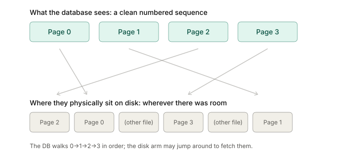
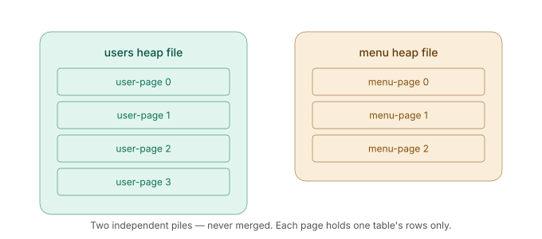

# How DB Store Data

## How do we actually read the data from disk?

- Disks (or SSDs) don’t let us read one-byte data at a time efficiently
- The OS and hardware move data in fixed-sized chunks - a block on the OS/hardware level (often 4KB)
- Reading a single row would still cost us a whole block read - so the DB maintains its own storage unit to align with this reality.
- This Unit is called a **page**
    - A page is the smallest amount of data that the DB reads from or writes to the disk in a single I/O operation
    - PostgreSQL → 8KB
    - MySQL/InnoDB → 16KB
    - SQL Server → 8KB.
    - Everything a DB does → buffering, caching, locking granularity, etc. is organized around the pages
- **That means, a database never reads a single row from the disk; it reads a page that contains the row, then finds the row inside that page**

## How rows (tuples/records) live inside a page

- A row is the actual data → one entry in the table
- Row data are variable length, so how we pack these inside a fixed-size page
- The answer is a slotted page structure
    

    
    
    - A slotted page has 3 regions
        - A header is on the top with metadata(number of slots, free space pointer, etc.).
        - A **slot array**(slot directory) that grows downward from the header. Each slot is a small pointer holding the location and length of one row within the page
        - The **actual row data,** which grows upward from the bottom of the page
- Free space sits in the middle; it shrinks when the slots array grows down, and rows grow up
- When we reference a row, we reference it by  `(page id, slot number)`
    - Postgres calls it a CTID
    - Oracle calls it a ROWID
    - When we create indexes, it also points to this identifier
- Deleting a row actually marks these slots as dead rather than deleting it immediately and shifting data
    - Actual cleaning (freeing space) is done by a separate cleanup process (vacuum/compaction)
    - How the DB handles multiple versions of a row and the delete state version is a separate discussion.
- **Pages are not shared between tables**
    - A single page never holds some `users` rows and some `orders` rows.
- How does the system decide which page stores a newly inserted row?
    - DB consults its **free space map** and finds out the page that can contain the row data
    - If no existing page can contain the row data, then it creates a new page
    - Even if a page can’t store row data due to smaller space availability, that smaller space(**internal fragmentation**) will be available for the next row to store (if it fits within the size)
    - When we insert a row, there is a **`fillfactor`**  which determines how much space to leave on a page, so that it can be used for **HOT updates** later. This topic is related to DB indexing.
    - That’s why the table file on the disk is usually bigger than the actual raw size of its data
- **An Exception**
    - If a row (or a single column value) that's too big for any page — a huge text blob then the DB stores the oversized data in separate overflow pages and leaves a pointer in the main row
    - PostgreSQL calls this mechanism TOAST; other DB has equivalant mechanism

## Heap files: the collection of pages

- Simplest way to organize a table's pages on disk
- A heap file = an unordered "pile" of pages. 
- "Heap" here just means "pile" — not the heap data structure

### Structure of the pile

- The pile is a numbered SEQUENCE of pages: page 0, page 1, page 2, ...
- The file grows by APPENDING a new page at the end
    - Empty table = just page 0
    - Page 0 filled/can’t hold new row entry → append page 1 → filled/can’t hold new row entry → append page 2, etc.
- A new page is created ONLY when no existing page has room for the row
- A full-table scan = read page 0, then page 1, then page 2 ... to the end

### Logical order vs physical placement (important distinction)

- The DB NUMBERS its pages 0,1,2,3 and treats them as a neat ordered sequence
- But WHERE those pages physically sit on disk is decided by the OS/filesystem,
not the DB
- So logical page order != physical adjacency on disk (can be fragmented)
    - When the DB asks the OS to grow the file by one page, the OS puts that page wherever it has a free block
    - which might be right after the previous one, or might be somewhere completely different on the platter if the disk is fragmented.
        
        
        

### 

### One pile PER table (not merged)

- Each table has its OWN separate heap file/pile
    - users table → user-page 0, 1, 2, ...
    - menu table → menu-page 0, 1, 2, ... (numbered from its own 0)
- The piles grow independently and never merge
    
    !separate_heap_file_per_table.svg
    
    
- **Follows from "one page = one table": a page can't mix users + menu rows,
so the two tables can't share one interleaved sequence**
- Scanning users touches only users pages; menu pages are never read

### How do inserts pick a page really?

- On insert, the DB looks for ANY page with enough free space (via the free
space map)
    - Then insert the new row in that page’s next available slot
- It does not pick the last/newest page deliberately
- If it can’t insert a row in a page at a particular time, that does not mean it won’t be able to insert any data to this page ever
    - If a page is full and can’t store more data in it, then:
        - When we delete some data from it, and vacuum frees the space.
        - Then that page will be free with some space and will be discoverable through the **free space map**.
        - Then we can insert data into this page if it has enough available space to store a row.
- A new page is added when there is no existing page to hold the new insert
- **This dumb insert(finding page and insert in available slot) makes the insert fast and cheaper**
    - find the room → insert
- Cost
    - `SELECT * FROM users WHERE id = 42`
    - finding a specific row (e.g. WHERE id = 42)
        - with no index = FULL TABLE SCAN
        - because the row could be anywhere in the pile → O(n)
- This is exactly the problem INDEXES solve:
    - An index (usually a B-tree) is a separate, SORTED structure mapping
    key values → (page, slot) identifiers
    - Lets us jump straight to the right page instead of scanning the pile
    - The heap holds the data once; each index is a separate "directory" into it
    - One table can have several indexes
- A table with NO indexes = pure heap, every lookup is a full scan
    - "add an index" is the first fix when a query is slower

## Full table scan (sequential scan)

- The most basic way to answer a query: walk the ENTIRE heap file page by page
and check every single row against what the query is looking for
- Postgres calls this a **sequential scan**
- Used when the DB has no faster way to locate the matching rows

### How it works

- Query like `SELECT * FROM users WHERE age = 30` with no faster access path
- DB doesn't know which pages hold matching rows → no choice but to read them all
- Read page 0 → check every row → read page 1 → check every row → ... → last page
- Can't stop early after finding a match: a later page might have more matches,
so it MUST look at every page to be sure it found them all

### Why it's O(n)

- Work grows in direct proportion to table size
- Double the rows → roughly double the pages → roughly double the scan time
- Small table (few pages) = scans instantly
- Huge table (millions of pages) = must read that entire volume off disk
    - e.g. a 20 GB table → a full scan reads 20 GB; no shortcut in the heap itself
- Cost is measured in PAGES, not rows (many rows share one page):
    - cost ≈ (number of pages in the heap) × (cost per page read)

### 

### Why it's slow on large tables (key nuance)

The trap: it's slow because there's SO MUCH to read — not because
the reading is done in a bad way.

- Think of reading every page of a book to find one word.
    - Flipping pages IN ORDER (page 1, 2, 3...) is the easy, fast way to flip.
    - What makes it slow is that the book has a million pages — you still
    have to look at all of them.
- A sequential scan is exactly this:
    - It reads pages in order (0, 1, 2, 3...), which is the fastest way to
    read from disk (the disk gives them one after another, no jumping around).
    - So the way it reads is not the problem — it's already the best way.
    - The problem is the AMOUNT: on a big table, it reads EVERYTHING.
- Now add the disk-is-slow fact:
    - Reading a whole big table means **moving all of it from slow disk into
    fast memory.**
    - Small table = little to read = fast.
    - Big table = a lot to read = slow.

Bottom line: slow disk + having to read the WHOLE table = the real reason full scans are slow on big tables.